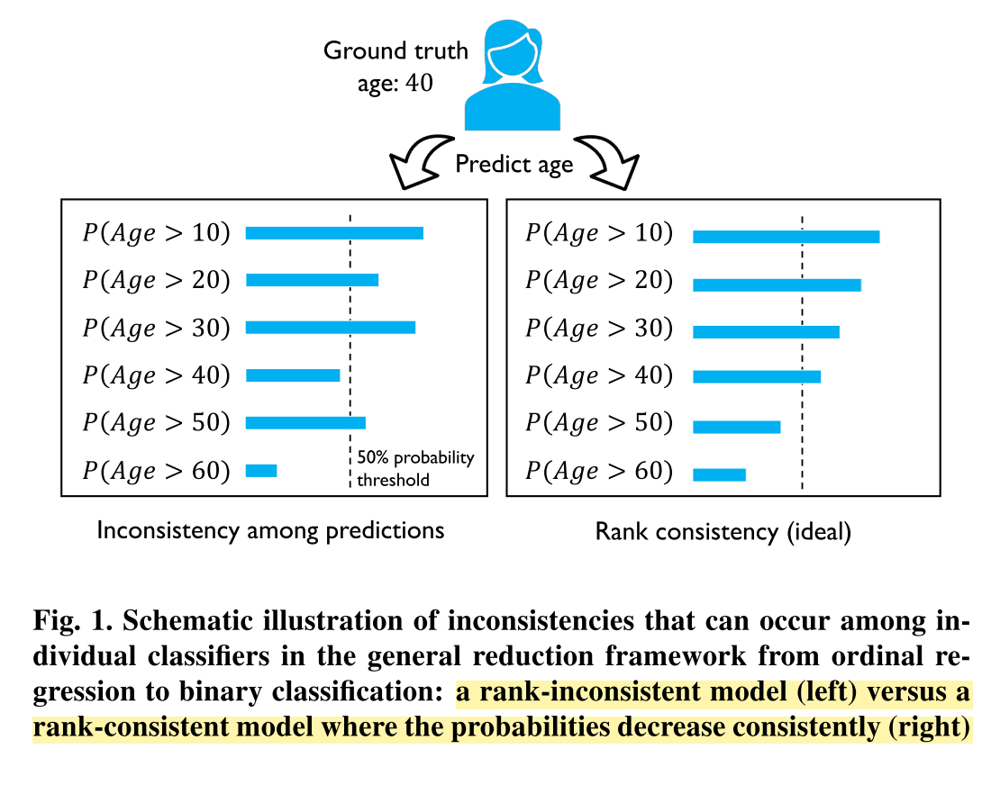

# CORAL : Rank-consistent Ordinal Regression for NN with application to age estimation

Date: Dec 12, 2020 → Dec 13, 2020
Property: Attribute, DL
Status: 1회독완료

[정리 원본](https://www.notion.so/bluecandle/CORAL-Rank-consistent-Ordinal-Regression-for-NN-with-application-to-age-estimation-874d8909dd27489d8fd566bc15f44027)

### 논문

---

[https://arxiv.org/abs/1901.07884](https://arxiv.org/abs/1901.07884)

### Code

---

[https://github.com/Raschka-research-group/coral-cnn](https://github.com/Raschka-research-group/coral-cnn)

### 이 논문의 한 줄

---

- 하나의 CNN 모델에 output layer의 weight를 공유하는 방식으로 rank consistency를 보장함. 그리고 label extension으로 인한 class imbalance 문제를 task-specific weighting을 통해 해결하여 ordinal regression의 inconsistency 문제를 해결하고 정확도 향상에 기여한 framework

### keywords

---

- Ordinal Regression
- rank consistency
- age prediction

### 내용정리

---

[https://blog.jesse.kim/post/154](https://blog.jesse.kim/post/154)

- 기존의 ordinal regression에 이런 고질적인 inconsistency를 해결하였고, 그럼으로써 정확도를 높이는 데 성공한 알고리즘.
- 하나의 CNN 모델에 output layer의 weight를 공유하는 방식으로 rank consistency를 보장함으로써, 그리고 label extension으로 인한 class imbalance 문제를 task-specific weighting을 통해 해결함으로써 기존 모델의 성능을 끌어올릴 수 있었던 CORAL.

### 문구

---

- Neural networks were equipped with ordinal regression capabilities by transforming ordinal targets into binary classification subtasks. However, this method suffers from inconsistencies among the different binary classifier.
- the proposed method is architecture-agnostic and can extend arbitrary state-of-the-art deep neural network classifiers for ordinal regression tasks.
- The extended binary classification approach ~~ neural network-based implementations of this approach commonly suffer from classifier ***inconsistencies*** among the binary rankings.

    

- Our proposed CORAL framework does neither require a cost matrix with convex-row conditions nor explicit weighting terms that depend on each training example to obtain a rank- monotonic threshold model and produce consistent predictions for each binary task.

### 알고리즘 설명

---

- Let $D = \{xi, yi\}^N_{i=1}$ be the training dataset consisting of N training examples. Here, $x_i ∈ X$ denotes the i-th training example and $y_i$ the corresponding rank.
- $y_i$ ∈ Y = {r1, r2, ...rK} with ordered rank rK > rK−1 > . . . > r1
- Let C be a K×K cost matrix, where $C_{y,r_k}$ is the cost of predicting an example (x, y) as rank $r_k$
- Typically, $C_{y,y}$ = 0 and $C_{y,r_k}$ > 0 for $y \neq r_k$
- In ordinal regression, we gen- erally prefer each row of the cost matrix to be V-shaped.
    - V-shaped... ⇒ $C_{y,r_{k−1}} ≥ C_{y,r_k} \ if\  r_k ≤ y \ and \ C_{y,r_k} ≤ C_{y,r_{k+1}} \ if \  r_k ≥ y$

    

- The classification cost matrix has entries $C_{y,r_k} = 1\{y \neq r_k\}$ that do not consider ordering information.
- In ordinal regression, where the ranks are treated as numerical values, the absolute cost matrix is commonly defined by $C_{y,r_k} = |y − r_k|.$

***Label Extension and rank prediction***

- Given a training dataset $D = \{x_i, y_i\}^N_{i=1}$ , a rank $y_i$ is first extended into K − 1 binary labels $y_i^{(1)}, \cdots , y^{(K-1)}_i$ such that $y^{(k)}_i \in \{0,1\}$ indicates whether $y_i$ exceeds rank $r_k$ for instance,  $y^{(k)}_i = 1\{y_i>r_k\}$ ⇒ '1' 이라고 되어있는 함수는 {} 안에 있는 내용이 true 이면 1이고 아니면 0이라는 뜻임.
- Based on the binary task responses, the predicted rank label for an input $x_i$ is obtained via $h(x_i) = r_q$. The rank index q is given by
    - $q = 1 + \sum^{K-1}_{k=1}f_k(x_i)$
    - where $f_k(x_i) \in \{0,1\}$ is the prediction of the k-th binary classifier in the ouput layer.
- We require that $\{f_k\}^{K−1}_{k=1}$ reflect the ordinal information and are rank-monotonic,
    - $f_1(x_i) ≥ f_2(x_i) ≥ . . . ≥ f_{K−1}(x_i)$, which guarantees **consistent predictions**.

***loss function***

- Let W denote the weight parameters of the neural network excluding the bias units of the final layer.
- The penultimate layer, whose output is denoted as $g(x_i,W)$, ***shares a single weight with all nodes in the final output layer***
- $σ(z) = 1/(1 + exp(−z))$
- The predicted empirical probability for task k is defined as
    - $\hat P(y^{(k)}_i = 1) = σ(g(x_i,W) + b_k)$
- loss function 은 결국 아래 식임 : weighted cross-entropy of K-1 binary classifiers

    그리고 $\lambda^{(k)}$ 는 task k 에 대한 importance parameter 임.

    

- For rank prediction, the binary labels are obtained via
    - $f_k(x_i) = 1{\hat P(y^{(k)}_i = 1) > 0.5}$

***Theoretical guarantees for classifier consistency***

- 증명 과정이 있긴한데, 그걸 굳이 다 하나하나 이해하진 않고, 그냥 결과만 받아들이기로 함!
- by minimizing the loss L , the learned bias units of the output layer are non- increasing such that
    - $b_1 ≥ b_2 ≥ . . . ≥ b_{K−1}$
- Consequently, the predicted confidence scores or probability estimates of the K − 1 tasks are decreasing, for instance,
    - $\hat P (y^{(1)}_ i = 1 )≥ \hat P (y^{(2)}_ i = 1 )≥ . . . ≥ \hat P (y^{(K-1)}_ i = 1 )$
- Consequently, $\{f_k\}^{K−1}_{k=1}$ are also rank-monotonic.

- Theorem 1 이 증명됨으로써 얻어지는 것들
    - Theorem 1 is free from this requirement and allows us to choose a fixed weight for each task that does not depend on the individual training examples, which greatly reduces the training complexity.
    - Under Theorem 1, the only requirement for guaranteeing rank monotonicity is that the task weights are non-negative
- 

### 기타

---

non-stationary : 불규칙하다는 정도로 이해.