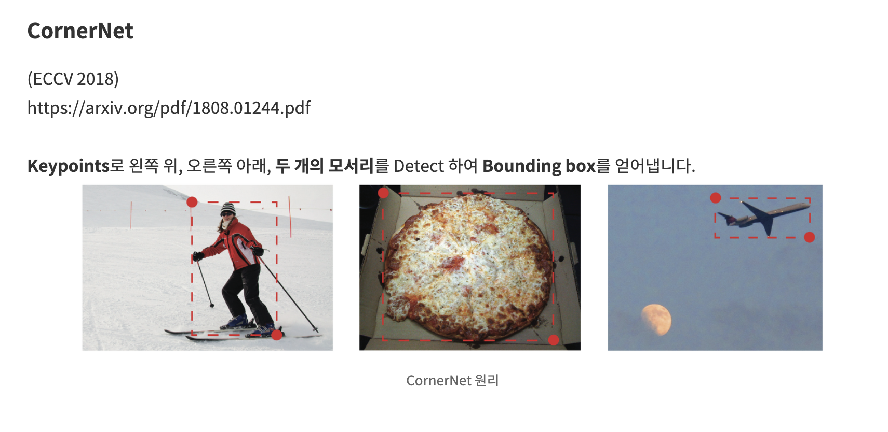

# CenterNet: Objects as Points

https://www.notion.so/CenterNet-Objects-as-Points-dfa6be07af9d470a9806e39b546c4c51

Date: Dec 3, 2020 → Dec 5, 2020
Property: DL, Object_Detection
Status: 1회독완료

### 논문

---

[https://arxiv.org/abs/1904.07850](https://arxiv.org/abs/1904.07850)

### Code

[https://github.com/xingyizhou/CenterNet](https://github.com/xingyizhou/CenterNet)

### 이 논문의 한 줄

---

[https://nuggy875.tistory.com/34](https://nuggy875.tistory.com/34)

- **물체마다 단 하나의 Keypoint인 중심점(Center Point)을 Estimate 합니다. 이로써 각 물체들은 모두 하나의 점(Key point)으로 표현이 됩니다. 따라서, grouping 과정이나 post-processing 과정(ex. NMS)들이 필요 없게 되고, 단 하나의 Anchor를 가지게 됩니다.**

### keywords

---

- Object Detection
- One-Stage Detector
- CornerNet ⇒ Key Point Estimation (**Single Keypoint Estimation)**

    ⇒ A center point can be seen as a single shape-agnostic anchor

    

    [https://nuggy875.tistory.com/34](https://nuggy875.tistory.com/34)

### 내용정리

---

[https://nuggy875.tistory.com/34](https://nuggy875.tistory.com/34)

- CenterNet은 box overlap이 아닌 오직 위치만 가지고 "Anchor"를 할당
- CenterNet은 오직 하나의 "Anchor"만을 사용
- CenterNet은 더 큰 output resolution (output stride of 4) 을 가짐.
- SSD 같은 이전 시도에서는 많은 Anchor box 를 사용하였다. 근데, 많은 Anchor box를 사용하게 되면, 정확도는 물론 높아지겠지만 Positive Anchor Box와 Negative Anchor box 사이의 **불균형**을 만들게 되고, 이는 당연히 training 속도를 늦추게 된다는 문제가 존재.
- 또한, 많은 수의 Anchor box는 어떤 사이즈로 할지, 어떤 비율로 할지, 등 많은 수의 hyperparameter와 많은 수의 선택지들을 만들어 낸다.
- Key point Estimation을 사용하여 고정적이지 않은 단 하나의 Anchor를 사용하는 방법을 'CenterNet' 에서 제시 ⇒ 그리고 CenterNet 에서도 이 개념을 사용!
- CenterNet의 우선적인 목적은 network를 통해 keypoint heatmap을 얻어내는 데에 있다.
- 학습 : 4개의 architecture(Fully-Convolutional Encoder-Decoder Network)에서 학습 진행.
    - ResNet-18 , ResNet-101 , DLA-34 , Hourglass-104
    - Heatmap 예측
    - CornerNet과 동일한 네트워크를 사용하여 Keypoint Prediction을 진행

[https://nuggy875.tistory.com/34](https://nuggy875.tistory.com/34)

- CenterNet은 keypoints, offset, object size를 predict 하기 위해서 하나의 네트워크를 사용
- **Keypoint 학습:**
    - Hard Positives (keypoint) << Easy Negatives (background)에 적합한 **RetinaNet**의 **Focal Loss**를 사용

    ***Focal loss***

    Focal loss 의 메인 아이디어는 다음과 같다. 다중 클래스 분류 문제에서, A, B, C 3개의 클래스가 존재한다고 하자. A 클래스는 상대적으로 분류하기 쉽고, B, C 클래스는 어렵다고 하자.

    총 100번의 epoch 에서 단지 10번의 epoch 만에 validation set 에 대해 99 % 의 정확도를 얻었다. 그럼에도 불구하고 나머지 90 epoch 에 대해 A 클래스는 계속 loss 의 계산에 기여한다.

    [I**dea]** 만약 상대적으로 분류하기 쉬운 A 클래스의 데이터 대신, **상대적으로 분류하기 어려운! *B, C 클래스의 데이터에 더욱 집중을 해서 loss 를 계산*을 하면 전체적인 정확도를 더 높일 수 있지 않을까?**

    예를 들어 batch size 가 64 라고 하면, 64 개의 sample 을 본 후, loss 를 계산해서 backpropagation 을 통해 weight 를 업데이트 하게 되는데 이 때, **이 loss 의 계산에 현재까지의 클래스 별 정확도를 고려한 weight 를 줌으로서 전반적인 모델의 정확도를 높이고자 하는 것**이다.

    

    Focal loss 는 어떤 batch 의 트레이닝 데이터에 같은 weight 를 주지 않고, **분류 성능이 높은 클래스에 대해서는 down-weighting 을 한다. 이 때**, $\gamma$ (gamma) 를 주어, 이 down-weighting 의 정도를 결정한다. **분류가 힘든 데이터에 대한 트레이닝을 강조하는 효과**.

- **Offsets 학습**: 이미지가 Network를 통과하게 되면 output의 사이즈는 보통 이미지보다 줄어듭니다. 예측된 heatmap에서 keypoint들의 위치를 다시 input image로 remapping 할 때, 정확성이 떨어질 가능성이 있습니다.
    - input image 는 network 를 통과하는 중에 있는 feature map 보다 크기 때문에, keypoint 로 선정된 지점들도 원래 input image 에서는 조금 엉뚱한 지점일 수 있다는거지!
    - **이를 조정해주는 변수가 Offset입니다. (CornerNet에서 적용한 방법) Offset 학습**의 loss function에는 **L1 Loss**를 사용.
- **Object Sizes 학습:**
    - CenterNet은 측정한 keypoint로부터 추가적으로 object size를 regress한다.
    - Object size 학습에는 L1 Loss를 사용
- **Overall 학습**:
    - CenterNet은 Keypoints, Offset, Size를 predict 하기 위해 Single Network를 사용합니다.
    - All outputs share a common fully-convolutional backbone Network!
- CenterNet은 우선 heatmap으로부터 각 Category마다 peaks들을 뽑아 냅니다.

    

    [https://nuggy875.tistory.com/34](https://nuggy875.tistory.com/34)

    - heatmap 에서 주변 8개 pixel보다 값이 크거나 같은 중간값들을 모두 저장하고, 값이 큰 100개의 peak들을 남겨놓습니다.
    - 뽑아낸 **peaks** (keypoints) 의 위치는 정수 형태인 (x, y)로 나타내어지고,이를 통해 **bounding box의 좌표**를 아래와 같이 나타낼 수 있습니다.

        

        [https://nuggy875.tistory.com/34](https://nuggy875.tistory.com/34)

    - **CenterNet**이 강조하는 점은 이러한 모든 Ouput 들은 **Single Keypoint Estimation**으로 부터 나왔다는 것.

### 문구

---

- We model an object as a single point — the center point of its bounding box.
- Current object detectors represent each object through an axis-aligned bounding box that tightly encompasses the object
- Sliding window based object detectors are however a bit wasteful, as they need to enumerate all possible object locations and dimensions.
- Peaks in this heatmap correspond to object centers.
- Inference is a single net- work forward-pass, without non-maximal suppression for post-processing
- Our approach is closely related to anchor-based one stage approaches.
- A center point can be seen as a single shape-agnostic anchor _ shape 에 대한 지식이 없이 동작하는 anchor 라고 볼 수 있다는 의미로 shape-agnostic anchor 라고 하는듯??
    - 하지만... 차이점이 존재??!
    - CenterNet assigns the “anchor” based solely on location, not box overlap
    - no manual thresholds for foreground and background classification
    - only have one positive “anchor” per object, and hence do not need Non- Maximum Suppression (NMS) ⇒ extract local peaks in the keypoint heatmap
    - CenterNet uses a larger output resolution (output stride of 4) compared to traditional object detectors [21, 22] (output stride of 16). This eliminates the need for multiple anchors.
    - Our method is similar to a one-stage version of Deep3Dbox or 3DRCNN .
- ***Training Time***
- ***[keypoint prediction network]:*** The training objective is a penalty-reduced pixelwise logistic regression with **focal loss**

    

- ***[offset prediction network]***: To recover the discretization error caused by the output stride, we additionally predict a local offset.
    - **L1 Loss**

        

- ***[object size] : L1 loss***

    

- ***[overall]***

    

- ***Inference time***
    - extract the peaks in the heatmap for each category independently
    - detect all responses whose value is greater or equal to its 8-connected neighbors and keep the top 100 peaks
    - $\hat{P_c}$ : class c 에 대해 detect 된 n 개의 center point set
    - use the keypoint values ${\hat Y_{{x_i}{y_i}c}}$ as a measure of its detection confidence, and produce a bounding box

        

    - $(\delta\hat x_i,\delta\hat y_i) = \hat O_{\hat x_i, \hat y_i}$ : offset prediction
    - $(\hat w_i, \hat h_i) : \hat S_{\hat x_i, \hat y_i}$ : size prediction
        - produced directly from the keypoint estimation without the need for IoU-based non-maxima suppression (NMS) or other post-processing
- ***Implementation Details***
    - We modify both ResNets and DLA-34 using deformable convolution layers [12] and use the Hourglass network as is
    - ResNet
        - change the channels of the three upsampling layers to 256, 128, 64, respectively, to save computation
        - add one 3 × 3 deformable convolutional layer before each up-convolution with channel 256, 128, 64, respectively
        - up-convolutional kernels are initialized as bilinear interpo- lation
    - DLA
        - We augment the skip connections with deformable convo- lution [63] from lower layers to the output
        - replace the original convolution with 3×3 deformable con- volution at every upsampling layer
        - add one 3 × 3 convolutional layer with 256 channel
        before each output head. A final 1 × 1 convolution then produces the desired output.
    - infetrence
        - use three levels of test augmentations: no augmentation, flip augmentation, and flip and multi-scale (0.5, 0.75, 1, 1.25, 1.5).

### 알고리즘 설명

---

[https://nuggy875.tistory.com/34](https://nuggy875.tistory.com/34)

### 기타

---

modality: 양식, 양상