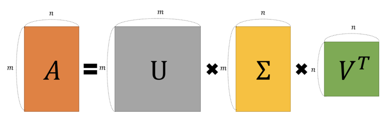

# Fast R-CNN

Date: Nov 30, 2020 → Dec 1, 2020
Property: Object_Detection
Status: 1회독완료
relation: https://www.notion.so/AI-GENERAL-e2b5a2274dbf49419bacdf8d4bc3c80d, https://www.notion.so/Deep-Learning-a388045a35074150a165698e3afdaccd

### 논문

---

[https://arxiv.org/pdf/1504.08083.pdf](https://arxiv.org/pdf/1504.08083.pdf)

### code

---

[https://github.com/rbgirshick/fast-rcnn](https://github.com/rbgirshick/fast-rcnn)

*This code base is no longer maintained and exists as a historical artifact to supplement my ICCV 2015 paper. For more recent work that's faster and more accurrate, please see Faster R-CNN (which also includes functionality for training Fast R-CNN).*

### 이 논문의 한 줄

---

- R-CNN 을 개선한것! 뭐가 문제였느냐?

원래 R-CNN은 RoI 도출하고 각 RoI별로 CNN 거친 후, classification, Bbox Regression 진행하는 구조였음. 당연히 각 RoI 마다 CNN 거치니까 엄청 훈련 힘들도 디텍션도 엄청 느렸다.

- 그래서 Fast R-CNN 은 뭘 한건데?

region proposal 을 CNN Level 로 통과시킨다. (전체 이미지에 대한 feature map 을 만들고, RoI를 feature map 크기에 맞추서 떼어내고(projection), 크기를 맞추는 거임(Pooling) ⇒ 고정된 크기의 벡터를 얻어야 FC Layer 로 갈 수 있으니!

**(1)**region proposal 추출 → 전체 image CNN 연산 → RoI projection, RoI Pooling

→ **(2)**classification, bounding box regression

- 하지만, 그래도 아직 한계는 있더라.

하지만, region proposal인 Selective search알고리즘을 ****CNN외부에서 **연산 ⇒** RoI 생성이 병목.

⇒ 그래서... 다음에 나온게 Faster R-CNN

⇒ Faster R-CNN 은 Region Proposal 과정까지 CNN level 에 포함시켜서 병목을 제거하고 시간 더 빠르게 한다는 아이디어! ⇒ 그래서 Faster R-CNN 은 Region Proposal Network + Fast R-CNN 같은거지.

### keywords

---

- Object Detection
- R-CNN
- SPPNet
    - [https://www.notion.so/bluecandle/Spatial-Pyramid-Pooling-a1d9b3789e034ade8aa6d55495f905a3](https://www.notion.so/bluecandle/Spatial-Pyramid-Pooling-a1d9b3789e034ade8aa6d55495f905a3)
    - 입력 이미지의 크기와는 상관없이 미리 설정한 bin의 개수와 CNN 채널 값으로 SPP의 출력이 결정되므로, 항상 동일한 크기의 결과를 리턴한다고 볼 수 있다!
        - ***의미***

            여러 가지 스케일로 convolution과 pooling을 하고 나온 다양한 특성을 연결(concatenate)해준다.

            ⇒ 이를 통해 멀티스케일로 특성을 추출하는 것을 병렬로 수행하는 효과를 얻을 수 있다!

            ⇒ 입력이미지의 크기와 관계없이 동일한 구조를 활용할 수 있다는 장점!

            ⇒ 따라서, ***제각기 다양한 크기와 비율을 가진 RoI 영역에 대해 적용하기 유리함***.

    - 근데, SPPNet 이 R-CNN 을 개선하기 위한 시도라고 했잖아. 실제로 효과도 좀 있었다고 했고! 근데 뭐가 문제일까 정확히??
        - ***The root cause is***: back-propagation through the SPP layer is highly inefficient when **each training sample (i.e. RoI) comes from a different image**, which is exactly how R-CNN and SPPnet networks are trained.
        - 흠...그렇지 SPPNet 에서 일정한 크기 (dimension x num of bins)로 이미지의 정보를 변환하는 과정을 거친다고는 하지만, 그 과정을 거치기 전의 이미지는 어쨌든 각각 다 다른거니까! (그리고, Fast R-CNN 논문에서 이야기하기로, RoI 의 Receptive field 가 전체 이미지인 경우도 생각해봐야한다고 이야기함. 뭐 대강 '비효율성' 이라는 지점을 강조하기 위해 말한듯!)

- RoI Pooling
- Hierarchical sampling
- end-to-end trainable Multi-task loss
- **SVD(Singular Vector Decomposition)**는 우리나라 말로 하면 **특잇값 분해**입니다.
    - **`M X N`** 형태의 행렬 **`A`**을 다음과 같은 형태로 분해하여 나타내는 것입니다.
    - $A = UΣV^{T}$

        

    SVD는 "**정보 복원**"을 위해 사용된다.
    특이값 분해는 분해되는 과정보다는 분해된 행렬을 다시 조합하는 과정에서 그 응용력이 빛을 발한다.

    기존의 U,Σ,$V^TU$,Σ,$V^T$로 분해되어 있던 AA행렬을
    특이값 p개만을 이용해 A’라는 행렬로 ‘부분 복원’ 시킨 할 수 있다.

    특이값의 크기에 따라 A의 정보량이 결정되기 때문에
    값이 큰 몇 개의 특이값들을 가지고도 충분히 유용한 정보를 유지할 수 있다.
    ...
    최대한 중요한 정보들만 부분 복원해서 사용하면 사진의 용량은 줄어들지만
    여전히 사진이 보여주고자 하는 내용은 살릴 수 있을 것이다.

### 내용정리

---

- RoI Pooling : 잘라낸 특성 맵의 영역은 여러 가지 모양과 크기를 가지므로, 해당 영역이 어떤 클래스에 속하는지 분류하기 위해 사용하는 fully-connected layer에 배치(batch) 입력값을 사용하려면 **영역의 모양과 크기를 맞추어 주어야 하는 문제**가 생김. 논문에서는 **RoI(Region of Interest) pooling**이라는 방법을 제안해서 **후보 영역에 해당하는 특성을 원하는 크기가 되도록 pooling하여 사용하는 것.**
    - 1개의 피라미드 SPP(Spatial Pyramid Network)로 고정된 크기의 feature vector를 만드는 과정으로도 설명할 수 있다! (논문에서  피라미드 사이즈는 7x7)
    - [https://ganghee-lee.tistory.com/36](https://ganghee-lee.tistory.com/36)

    

    - Fast R-CNN에서 먼저 입력 이미지를 CNN에 통과시켜 feature map을 추출한다.
    - 그 후 이전에 미리 Selective search로 만들어놨던 RoI(=region proposal)을 feature map에 projection시킨다.
    - 위 그림의 가장 좌측 그림이 feature map이고 그 안에 hxw크기의 검은색 box가 투영된 RoI이다.
    - **(1)** 미리 설정한 HxW크기로 만들어주기 위해서 (h/H) * (w/H) 크기만큼 grid를 RoI위에 만든다.
    - **(2)** RoI를 grid크기로 split시킨 뒤 max pooling을 적용시켜 결국 **각 grid 칸마다 하나의 값을 추출**한다.
    - 위 작업을 통해 feature map에 투영했던 **hxw크기의 RoI는 HxW크기의 고정된 feature vector로 변환**된다.

- pre-trained CNN 모델을 활용한다.
    - 단, 마지막 max pool 은 RoI Pooling 으로 대체된다
    - 마지막 fc  와 softmax activation 은 두 가지로 대체된다 :  (1) fc+ softmax (K+1 class 에 대한)(2) category specific Bbox Regressors.
- end-to-end trainable

    ⇒ 기존 R-CNN 에서, **bounding box regression은 CNN을 거치기 전의 region proposal 데이터가 input으로 들어가고 SVM은 CNN을 거친 후의 feature map이 input으로 들어가기에 연산이 겹치지 않는다.**

    ⇒ RoI Pooling을 추가함으로써 이제 RoI영역을 CNN을 거친후의 feature map에 투영시킬 수 있었다. 따라서 동일 data가 각자 softmax(classification), bbox regressor(localization)으로 들어가기에 연산을 공유한다. 이는 이제 모델이 end-to-end로 한 번에 학습시킬 수 있다는 뜻이다.

    ⇒ 그리고 한 번의 학습으로 둘 다 학습시키기 위한 Loss 가 제안되었음 (multi-task loss)

### 문구

---

- detection requires the accurate localization of objects ⇒ ***challenges***
    - numerous candidate object locations (often called “***proposals***”) must be processed.
    - these candidates provide only rough localization that must be refined to achieve precise localization
- We propose a single-stage training algorithm that **jointly learns to classify object proposals and refine their spatial locations**
- R-CNN 은 multi-stage 이고, training 에 공간과 시간이 많이 필요하며, Detection도 느리다!
    - R-CNN is slow because it performs a ConvNet forward-pass for each object proposal, without sharing computation
- We propose a new training algorithm that fixes the disadvantages of R-CNN and SPPnet, while improving on their speed and accuracy

- processes the whole image with several convolutional (conv) and max pooling layers to produce a conv feature map
- for each object proposal a region of interest (RoI) pooling layer ex- tracts a fixed-length feature vector from the feature map
- ***RoI Pooling*** : RoI max pooling works by dividing the `h × w` RoI window into an `H × W` grid of sub-windows of approximate size `h/H ×w/W` and then max-pooling the values in each sub-window into the corresponding output grid cell.
- RoIs from the same image share computation and memory in the forward and backward passes
- One concern over this strategy is it may cause slow training convergence because RoIs from the same image are correlated. This concern does not appear to be a practical issue and we achieve good results with N = 2 and R = 128 using fewer SGD iterations than R-CNN.
- Hierarchical sampling: stochastic gradient descent (SGD) mini-batches are sampled hierarchically
- ***Multi-task loss***: We use a multi-task loss L on each labeled RoI to jointly train for classification and bounding-box regression
    - $L(p, u, t^u, v) = L_{cls}(p, u) + λ[u ≥ 1]L_{loc}(t^u, v)$
    - $L_{cls}(p, u) = −\log p_u$is log loss for true class u
    - Iverson bracket indicator function [u ≥ 1] evaluates to 1 when u ≥ 1 and 0 otherwise.
- loss for Bbox regression ⇒ outlier 에 대해 더 robust한 $L_1$ loss 임을 알 수 있다.

    

- **When the regression targets are unbounded, training with L2 loss can require careful tuning of learning rates in order to prevent exploding gradients. Eq. 3 eliminates this sensitivity**
    - 오호... 하긴 회귀문제에서 $L_2$ loss 잘못쓰면 제곱하면서 엄청 커져버릴 수 있겠구나!
- Back-propagation through RoI pooling layers  for each mini-batch RoI r and for each pooling output unit $y_{rj}$, the partial derivative $∂L/∂y_{rj}$ is accumulated if i is the argmax selected for $y_{rj}$ by max pooling
- All layers use a per-layer learning rate of 1 for weights and 2 for biases (per-layer learning rate??) and a global learning rate of 0.001
    - The Layer-wise Adaptive Rate Scaling (LARS) optimizer by You et al. is an extension of SGD with momentum which determines a learning rate per layer by 1) normalizing gradients by L2 norm of gradients 2) scaling normalized gradients by the L2 norm of the weight in order to uncouple the magnitude of the update from the magnitude of the gradient.
- scale-invariant object detection
    - (1) via “brute force” learning
        - each image is processed at a pre-defined pixel size during both training and testing
        - At test-time, the image pyramid is used to approximately scale-normalize each object proposal
    - (2) by using image pyramids.
    - for detection the number of RoIs to process is large and nearly half of the forward pass time is spent computing the fully connected layers ⇒ **truncated SVD** 를 이용한 압축?!
        - Truncated SVD reduces the parameter count from uv to t(u + v), which can be significant if t is much smaller than min(u, v).
- 

### 알고리즘 설명

---

### 기타

---

streamline : (시스템을) 간소화하다

elucidate: (더 자세히) 설명하다

# 정리 참고자료

---

[https://ganghee-lee.tistory.com/36](https://ganghee-lee.tistory.com/36)