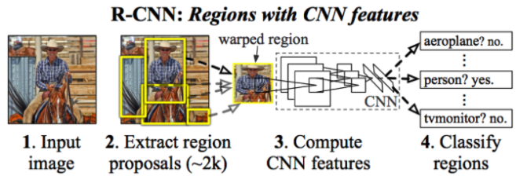

# R-CNN

Date: Nov 30, 2020 → Nov 30, 2020
Property: DL, Object_Detection
Status: 1회독완료
relation: https://www.notion.so/AI-GENERAL-e2b5a2274dbf49419bacdf8d4bc3c80d, https://www.notion.so/Deep-Learning-a388045a35074150a165698e3afdaccd

## 논문

---

[R-CNN.pdf](images/R-CNN.pdf)

## 이 논문의 한 줄

---

Sliding window 기법의 한계를 극복한 Selective Search 방식을 통해 RoI 도출을 개선하고 CNN을 통한 Object Detection 의 시작에 중요한 역할을 한 논문.

## keywords

---

- Region Proposal
- RoI
- Selective Search
- Bbox Regression

### 내용정리

---

- sliding window 의 한계를 보완하는 selective search 방식을 통해 Region Proposal 수행
- 추출된 RoI를 같은 size 로 warp 하여 CNN 에 넣어서 feature extraction 진행
- (1,4096) 형태로 변환 후 고정길이의 feature vector 생성
- feature vector를 Linear SVM 을 통해 classification 진행
    - why svm ? classifier로 softmax보다 SVM이 더 좋은 성능을 보여서 SVM 채택.
    - SVM은 CNN으로부터 추출된 각각의 feature vector들의 점수를 class별로 매기고, 객체인지 아닌지, 객체라면 어떤 객체인지 등을 판별하는 역할을 하는 Classifier.
- 그리고 localization error를 줄이기 위해 CNN feature 를 이용하여 Bbox regression model을 적용.

auxiliary : 보조의 예비의

### 문구

---

- a simple and scalable detection algorithm that improves mean average precision (mAP) by more than 30% relative to the previous best result on VOC 2012—achieving a mAP of 53.3%
- ***Since we combine region proposals with CNNs, we call our method R-CNN: Regions with CNN features***

## 알고리즘 설명

---

[참고자료]

[https://ganghee-lee.tistory.com/35](https://ganghee-lee.tistory.com/35)

1. Image를 입력받는다.

2. **Selective search** 알고리즘에 의해 regional proposal output 약 2000개를 추출한다.

추출한 regional proposal output을 모두 동일 input size로 만들어주기 위해 warp해준다.

(**왜 동일 input size로 만들어줄까? :** 사실 **Convolution Layer에는 input size가 고정이지 않다.** 그러나 마지막 **FC layer에서의 input size는 고정**이므로 Convolution Layer에 대한 output size도 동일해야한다. 따라서 **Convolution Layer에 입력에서부터 동일한 input size**로 넣어주어서 **output size를 동일하게** 하는 것이다.)

3. 2000개의 warped image를 각각 CNN 모델에 넣는다.

4. 각각의 Convolution 결과에 대해 classification을 진행하여 결과를 얻는다.

의 과정을 수행하기 위해 R-CNN은 세 가지 모듈로 나누어 놓았다.

- **1. Region Proposal :** "Object가 있을법한 영역"을 찾는 모듈 (기존의 Sliding window방식의 비효율성 극복)
    - Sliding window 방식의 비효율성을 극복하기 위해 Selective Search 사용

    

    - 색상, 질감, 영역크기 등.. 을 이용해 non-object-based segmentation을 수행한다.
    - 이 작업을 통해 좌측 제일 하단 그림과 같이 많은 small segmented areas들을  얻을 수 있다.
    - Bottom-up 방식으로 small segmented areas들을 합쳐서 더 큰 segmented areas들을 만든다.
    - 작업을 반복하여 최종적으로 2000개의 region proposal을 생성한다.

    Selective search알고리즘에 의해 2000개의 region proposal이 생성되면 이들을 모두 CNN에 넣기 전에같은 사이즈로 warp시켜야한다. (CNN output 사이즈를 동일하게 만들기 위해 - For FC layer)

- **2. CNN** : 각각의 영역으로부터 고정된 크기의 Feature Vector를 뽑아낸다.(고정된 크기의 output을 얻기위해 warp 작업을 통해 크기를 찌그러뜨려서 동일 input size로 만들고 CNN에 넣는다.)
- **3. SVM** : Classification을 위한 선형 지도학습 모델
    - (**왜 Classifier로 Softmax를 쓰지 않고 SVM을 사용했을까?** : CNN fine-tuning을 위한 학습 데이터가 시기상 많지 않아서 Softmax를 적용시키면 오히려 성능이 낮아져서 SVM을 사용했다.)

### Bounding Box Regression

Selective search로 만든 bounding box는 정확하지 않기 때문에 물체를 정확히 감싸도록 조정해주는 ***bounding box regression(선형회귀 모델)***이 존재한다.

bounding box regression 수식

### **단점**

1. 여기서 selective search로 2000개의 region proposal을 뽑고 각 영역마다 CNN을 수행하기 때문에 **CNN연산 * 2000** 만큼의 시간이 걸려 수행시간이 매우 느리다.

2. CNN, SVM, Bounding Box Regression 총 세가지의 모델이 **multi-stage pipelines**으로 한 번에 학습되지 않는다. 각 region proposal 에 대해 ConvNet forward pass를 실행할때 **연산을 공유하지 않기에 end-to-end 로 학습할 수 없다.**

(그치, 각각의 region proposal 에 대해 CNN 이 forward pass 되는 과정이 있는거니까! 각 과정이 어떤 연산을 했는지 공유되지 않는다는 의미!)

R-CNN에서의 학습과정 (출처 : https://blog.lunit.io/2017/06/01/r-cnns-tutorial/)

따라서 SVM, bounding box regression에서 학습한 결과가 **CNN을 업데이트 시키지 못한다.**

**"그리고 이 두가지 문제를 RoI pooling으로 해결한 Fast R-CNN이 나오게 된다."**

## 기타

---