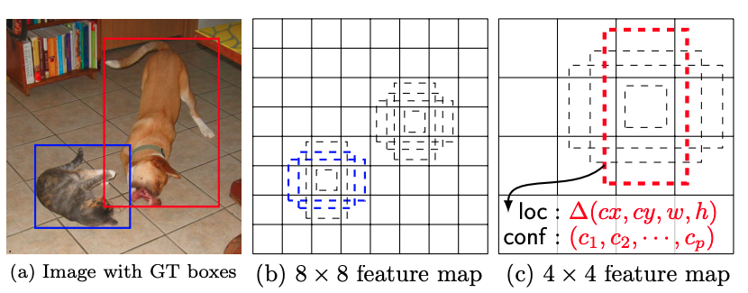

# SSD

Date: Dec 1, 2020 → Dec 2, 2020
Property: DL, Object_Detection
Status: 1회독완료

### 논문

---

[SSD.pdf](images/SSD.pdf)

### code

---

[https://github.com/weiliu89/caffe/tree/ssd](https://github.com/weiliu89/caffe/tree/ssd)

### 이 논문의 한 줄

---

[https://yeomko.tistory.com/20](https://yeomko.tistory.com/20)
**Fully Convolution Network에서 처럼 앞단 컨볼루션 피쳐맵을 끌어와 사용하여 detail을 잡아내고**

**Faster RCNN의 anchor 개념을 가져와 다양한 형태의 object들도 잡아낼 수 있도록 한다.**

- CNN에서 뽑은 특성 맵의 한 칸은 생각보다 큰 영역의 정보를 담게 됩니다. 여러 컨볼루션 레이어와 pooling을 거치기 때문에 한 특성 맵의 한 칸은 최초 입력 이미지의 넓은 영역(receptive field)을 볼 수 있게 됨.
- YOLO의 경우 이 특성이 담고 있는 정보가 넓은 영역을 커버하기 때문에 **작은 물체를 잡기에 적합하지 않다.** 이러한 **단점을 해결하고 다양한 크기의 특성 맵을 활용하고자 한 것**이 **SSD.** (YOLO 는 grid 로 나누어: 그물로 이미지를 떠낸다는 느낌이기 때문에, 그 그물에 걸리지 않는 작은 크기라면 안 잡힌다는 설명도 ㅇㅇ)
- SSD는 다양한 크기의 특성 맵으로부터 classification과 바운딩 박스 regression을 수행.

### keywords

---

- Object Detection
- Real-Time
- One-Stage Detector
- 

### 내용정리

---

[https://yeomko.tistory.com/20](https://yeomko.tistory.com/20)

- SSD는 Yolo와 달리 컨볼루션 과정을 거치는 중간 중간 피쳐맵들에서 모두 Object Detection을 수행
- **Default Box: ****Faster R-CNN에서 anchor의 개념으로 비율과 크기가 각기 다른 기본 박스를 먼저 설정해놓아서 Bounding Box를 추론하는데 도움을 주는 장치

    

- SSD는 각각의 피쳐맵을 가져와서 비율과 크기가 각기 다른 Default Box를 투영.
- 그리고 이렇게 찾아낸 박스들에 bounding box regression를 적용하고 Confidence Level을 계산
    - ⇒ Yolo가 아무런 기본 값 없이 2개의 Box를 예측하도록 한 것과 대조적.
- 이렇게 각 층별 피쳐 맵들을 가져와 Object Detection을 수행한 결과들을 모두 합하여 로스를 구한 다음, 전체 네트워크를 학습시키는 방식으로 1 Step end-to-end Object Detection 모델을 구성
- **Default box** : 입력 이미지에서 default box가 위치할 중심점을 구하고, 구해진 중심점 좌표들에 원래의 입력이미지 크기를 곱해서 중심점을 구하고, 각각의 중심점마다 default box를 그려주면 된다.
- Loss Function : **기본적으로 Cross Entrophy Loss**라고 생각하시면 되는데, 여기서 $x^p_{ij}$라는 값이 등장합니다. 이는 즉 특정 그리드의 i번째 디폴트 박스가 p클래스의 j번째 ground truth box와 match가 된다 (IoU가 0.5 이상)라는 의미입니다. 즉, ***모델이 물체가 있다고 판별한* 디폴트 박스들 가운데서 해당 박스의 ground truth 박스하고만 cross entrophy loss를 구하겠다는 의미**

    

    

    - The model loss is a weighted sum between localization loss ($L_{loc}$) and confidence loss (e.g. Softmax, $L_{conf}$)
    - N is the number of matched default boxes. If N = 0, wet set the loss to 0
    - We design the tiling of default boxes so that specific feature maps learn to be responsive to particular scales of the objects
    - Suppose we want to use m feature maps for prediction. The scale of the default boxes for each feature map is computed as

        

    - where $s_{min}$ is 0.2 and $s_{max}$ is 0.9, meaning the lowest layer has a scale of 0.2 and the highest layer has a scale of 0.9, and all layers in between are regularly spaced.

### 문구

---

- Our approach, named SSD, discretizes the output space of bounding boxes into a set of default boxes over different aspect ratios and scales per feature map location.
- SSD is simple relative to methods that require object proposals because it completely eliminates proposal generation and subsequent pixel or feature resampling stages and encapsulates all computation in a single network.
- these approaches(Two-Stage Detector 계열) have been too computationally intensive for em- bedded systems and, even with high-end hardware, too slow for real-time applications.
- SSD does not resample pixels or features for bounding box hypotheses
    - The fundamental improvement in speed comes from eliminating bounding box proposals and the subsequent pixel or feature resampling stage.
- multiple layers for prediction at different scales—we can achieve high-accuracy using relatively low resolution input, further increasing detection speed.
- The core of SSD is predicting category scores and box offsets for **a fixed set of default bounding boxes** using small convolutional filters applied to feature maps.
- SSD only needs an input image and ground truth boxes for each object during training.
- we evaluate a small set (e.g. 4) of default boxes of different aspect ratios at each location in several feature maps with different scales (e.g. 8 × 8 and 4 × 4 in (b) and (c))
    - 각각 사이즈가 다른 Feature map (conv 거치면서 생성되는 점점 작아지는 feature map들) 에 대해 각각 default box 를 정해진 수만큼 각기 다른 비율로, 각 자리(물체가 있는 자리)에 생성한다는 의미.
    - 그리고 For each default box, we predict both the shape offsets and the confidences for all object categories : 위에서 생성한 각각의 default box 에 대해 물체 shape offset 을 도출하고 물체 카테고리 각각에 대한 cofidence(지금 이 박스 안에 있는 물체가 특정 class 의 물체일 확률)를 계산.
- Loss function : The model loss is a weighted sum between localization loss (e.g. Smooth L1 [6]) and confidence loss (e.g. Softmax).
- network that produces a fixed-size collection of bounding boxes and scores for the presence of object class instances in those boxes, followed by a non-maximum suppression step to produce the final detections.
- ***YOLO 와의 차이점***: SSD model adds several feature layers to the end of a base network, which predict the offsets to default boxes of different scales and aspect ratios and their associated confidences
- for each box out of k at a given location, we compute c class scores and the 4 offsets relative to the original default box shape.
- Our default boxes are similar to the anchor boxes used in Faster R-CNN, however we apply them to several feature maps of different resolutions. Allowing **different default box shapes in several feature maps let us efficiently discretize the space of possible output box shapes**.
- ***Training***
    - During training we need to determine which default boxes corre- spond to a ground truth detection and train the network accordingly.
    - match default boxes to any ground truth with **jaccard overlap(??)** higher than a threshold (0.5). This simplifies the learning problem, allowing the network to predict high scores for multiple overlapping default boxes rather than requiring it to pick only the one with maximum overlap

### 알고리즘 설명

---

[https://yeomko.tistory.com/20](https://yeomko.tistory.com/20)

- pretrained된 VGG의 Conv5_3층까지 통과하며 피쳐를 추출
- 추출된 피쳐맵을 컨볼루션을 거쳐 그 다음 층에 넘겨주는 동시에 Object Detection을 수행
- 이전 Fully Convolution Network 에서 컨볼루션을 거치면서 **디테일한 정보들이 사라지는 문제점을 앞단의 피쳐맵들을 끌어오는 방식으로 해결 (다음 층으로 넘어가기 전에 전에 detection 수행하여.)**
- VGG를 통과하며 얻은 피쳐맵을 대상으로 쭉쭉 컨볼루션을 진행하여 최종적으로는 1x1 크기의 피쳐맵까지 뽑습니다

[https://yeomko.tistory.com/20](https://yeomko.tistory.com/20) , SSD 구조를 더 자세히 표현한 그림

[https://yeomko.tistory.com/20](https://yeomko.tistory.com/20) , Detector, classifier 의 구조 예시

### 기타

---

jaccard overlap(??)

추후 찾아볼 필요 있다.

### 참고자료

---

[https://yeomko.tistory.com/20](https://yeomko.tistory.com/20)