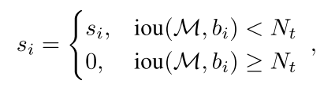

# Soft-NMS_Improving Object Detection With One Line of Code_1704.04503

Date: Dec 24, 2020 → Dec 26, 2020
Status: 1회독완료
분류: CV, DL, Object_Detection
요약: 기존 NMS 는 threshold 가 높아도, 낮아도 문제가 발생할 여지가 있다. 이 문제점을 해결하고자 overlap 이 발생하는 구역과 가까운 detection box 는 많은 영향을 받고, 멀리 있는 detection box 는 영향을 적은 영향을 받도록 하는 함수를 적용한 rule 을 새로 제안한다. 또한, 이 효과가 continous 하게 적용되길 원하기 때문에, pruning step 에서 Gaussian penalty function 을 적용하는 것을 제안한다.
linear 하다는 점을 제외하면 뭔가 focal loss 가 생각나는 아이디어

[notion 요약](https://www.notion.so/bluecandle/Soft-NMS_Improving-Object-Detection-With-One-Line-of-Code_1704-04503-6b7a7a666dfd4fa4936c2b12fdce8f00)

### 논문

---

[NMS_Improving Object Detection With One Line of Code_1704.04503.pdf](images/NMS_Improving_Object_Detection_With_One_Line_of_Code_1704.04503.pdf)

### code

---

[https://github.com/bharatsingh430/soft-nms](https://github.com/bharatsingh430/soft-nms)

### 이 논문의 한 줄

---

기존 NMS 는 threshold 가 높아도, 낮아도 문제가 발생할 여지가 있다. 이 문제점을 해결하고자 overlap 이 발생하는 구역과 가까운 detection box 는 많은 영향을 받고, 멀리 있는 detection box 는 영향을 적은 영향을 받도록 하는 함수를 적용한 rule 을 새로 제안한다. 또한, 이 효과가 continous 하게 적용되길 원하기 때문에, pruning step 에서 Gaussian penalty function 을 적용하는 것을 제안한다.

linear 하다는 점을 제외하면 뭔가 focal loss 가 생각나는 아이디어

### keywords

---

- Object Detection

### 내용정리

---

### 문구

---

- an algorithm which decays the detection scores of all other objects as a continuous function of their overlap with M.
- ***[문제의식]*** computational bottleneck 을 추가하는 방법이라면, practical use 의 측면에서 해당 방법론은 제외될 것이다!
    - 그리고... Moreover, if a complex module is introduced which requires re-training of models which leads to a little improvement in performance, it will also be ignored.
    - 그치... 성능 조금 올리자고 아예 모델을 새로 학습해야하는 상황이라면, 실질적인 관점에서는 잘 안쓰이게 되는 것이 맞지! 아예 성능을 확 끌어올려 줄 수 있는것이 아니라면!
    - 이런 맥락에서, However, if a simple module can improve perfor- mance without requiring any re-training of existing models, it would be widely adopted. 그치 ㅇㅇ 뭐 새로 학습할 필요도 없이 기존 모델에 붙여서 쓸 수 있는 작은 모듈이라면 실사용 상황에서 환영받는다 뭐 그런거.
- non-maximum suppression is used as a post-processing step to obtain final detections
- We propose to revise the detection scores by scaling them as a linear or Gaussian function of overlap.
- Hence, even in state-of-the-art detectors, non-maximum suppression is used to obtain the final set of detections as it significantly reduces the number of false positives
- However, if we lower the detection scores as a function of its overlap with M, it would still be in the ranked list, although with a lower confidence.
    - 물체가 겹친 경우, score 가 최고 score M 보다 낮은 물체의 점수를 아예 0으로 만들지 않고 M 에 관한 함수를 통해 낮춘다면, 계속 ranked list 에 존재하게 된다.
    - Q. 이렇게 아예 0으로 만들지 않고, 특정 함수를 통해 비례하여 낮춘다는 점에서 soft-nms 라는건가??
    - we propose a single line modification to the traditional greedy NMS algorithm in which we decrease the detection scores as an increasing function of overlap instead of setting the score to zero as in NMS.
    - 맞구만!
- Since there is no constraint in the network which forces it to generate a unique RoI for an object, multiple proposals may correspond to the same object. Hence, other than the first correct bounding-box, all other boxes on the same object would generate false positives.
    - To alleviate this problem, non-maximum-suppression is performed on detection boxes of each class independently, with a spec- ified overlap threshold
    - 오호... 그치 애초에 하나의 물체에 대해 고유한 RoI 를 생성하라는 규칙같은건 존재하지 않으니까... 결국 하나의 옳은(correct) box 말고 다른 box 들은 false positive를 만드는거겠지!

### Soft-NMS 의 작동방식

- NMS 에서 threshold 를 너무 낮게 설정하는 것이 문제가 되는 상황에 대해 생각해보자구.
    - applying NMS with a low threshold like 0.3 could lead to a drop in average precision when the overlap criterion during evaluation for a true positive is 0.7.
    - This is because, there could be a detection box $b_i$ which is very close to an object (within 0.7 overlap), but had a slightly lower score than M (M did not cover the object), thus $b_i$ gets suppressed by a low $N_t$.
    - 그치... 실제 Object 와 아주 가까이 있는 box _ overlap 0.7 이상 _ 인데, 가장 높은 score 인 M 보다 아주 조금 낮다는 이유로 무시될 수 있다는거지. ( overlap 기준 0.7에 걸린 것이기도 하고)
    - Therefore, suppressing all nearby detection boxes with a low $N_t$ would increase the miss-rate.
- 그럼 threshold 를 높게 설정하면 어떻게 되느냐?
    - 그래도 문제야!
    - Also, using a high $N_t$ like 0.7 would increase false positives when $O_t$ is lower and would hence drop precision averaged over multiple thresholds.
- 그니까... 이러나 저러나 기존 NMS 는 문제가 발생하니까 다시 한 번 생각해보자구!
    - To overcome these difficulties, we revisit the NMS algorithm in greater detail. **The pruning step in the NMS algorithm can be written as a re-scoring function.**

        **(아래는 기존 NMS 알고리즘)**

    

- Suppose, instead, we decay the classification score of a box $b_i$ which has a high overlap with M, rather than suppressing it altogether.
- 흠... 그니까 결국 세 가지 상황에 대해서 개선이 이루어져야 한다!!
    - Score of neighboring detections should be decreased to an extent that they have a smaller likelihood of increasing the false positive rate, while being above obvious false positives in the ranked list of detections.
        - 인근한 detection 결과의 점수가 false positive 를 증가시키지는 않지만, 그렇다고 인근에 있는 다른 자명한(obvious) false positive 들 보다는 우위에 있어야 한다.
    - Removing neighboring detections altogether with a low NMS threshold would be suboptimal and would increase the miss-rate when evaluation is performed at high overlap thresholds.
        - 낮은 NMS threshold 를 통해 인근한 모든 detection 을 죽여버리는것은 최적이 아니며, high overlap threshold 를 기준으로 evaluation 이 이루어질 때는 miss-rate 가 높아지게 만드는 요인까지 된다.
    - Average precision measured over a range of overlap thresholds would drop when a high NMS threshold is used.
        - 높은 NMS threshold 를 사용하면 overlap threshold 값에 상관없이 average precision 이 감소할 것이다.

***Rescoring functions for Soft-NMS***

- It is also clear that scores for detection boxes which have a higher overlap with M should be decayed more, as they have a higher likelihood of being false positives.
    - 고로... pruning step 을 아래 규칙으로 update 하는 것을 제안한다!

    

    - The above function would decay the scores of detections above a threshold Nt as a linear function of overlap with M.
    - detection boxes which are far away from M would not be affected and those which are very close would be assigned a greater penalty.
- 근데... penalty function 자체가 continuous 했으면 좋겠단 말이지??
    - It would be ideal if the penalty function was continuous, otherwise it could lead to abrupt changes to the ranked list of detections.
    - Taking this into consideration, we propose to update the pruning step with a Gaussian penalty function.

    

    - This update rule is applied in each iteration and scores of all remaining detection boxes are updated.
- 한 iteration 실행은 O(N), 그리고 전체는 O($N^2)$ 기존 NMS 와 같음.
- Note that Soft-NMS is also a greedy algorithm and does not find the globally optimal re-scoring of detection boxes.

### 알고리즘 설명

---

⇒ We propose to revise the detection scores by scaling them as a linear or Gaussian function of overlap.

1. starts with a list of detection boxes B with scores S
2. After selecting the detection with the maximum score M, it removes it from the set B and appends it to the set of final detections D.
3. also removes any box which has an overlap greater than a threshold Nt with M in the set B.
4. This process is repeated for remaining boxes B.

근데, 인근해있는 detection 의 점수를 0으로 만들면... 실제로 존재했지만 존재하지 않은 것으로 처리되어 average precision 을 떨어트릴 것임!

However, if we lower the detection scores as a function of its overlap with M, it would still be in the ranked list, although with a lower confidence.

⇒ 근데, 그걸 점수를 0으로 만들지 않고 최고 점수 M 과의 overlap 에 대한 funtion 을 통해 낮춘다면, ranked list 에 아직 존재하게 될 것임. 물론, confidnece 는 낮아지겠지만!

*일단 object detection 이 일반적으로 어떻게 이루어지는지 생각해보고, NMS 는 원래 어느 자리인지 봐보자.*

1. RoI 뽑히고 ( object category 와 상관없이 )
2. 그리고 각 RoI 에 대해 class 별 점수가 매겨짐 ( classification network )
3. 그리고 RoI 위치가 regression network 에 의해 약간 갱신됨.
4. 그리고! 마지막에 NMS 가 object detection 에 적용되는거지!

### 기타

---

bifurcate : 두 갈래로 나뉘다.

⇒ The network bifurcates into two layers ~~.

Focal loss