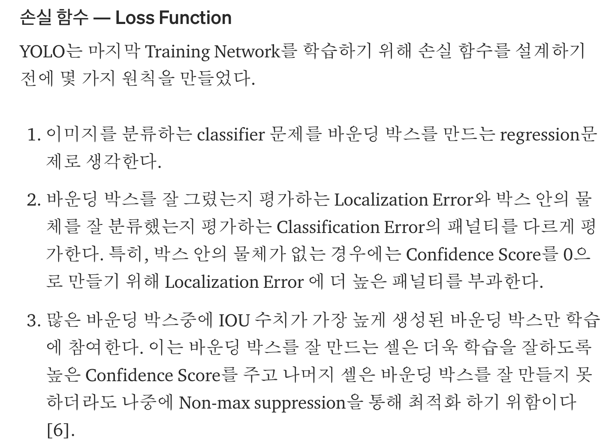

# YOLOv1

Date: Dec 1, 2020 → Dec 2, 2020
Property: DL, Object_Detection
Status: 1회독완료

### 논문

---

YOLOv1 : [https://arxiv.org/pdf/1506.02640.pdf](https://arxiv.org/pdf/1506.02640.pdf)

### 이 논문의 한 줄

---

- 이미지를 그리드로 나누고, 슬라이딩 윈도 기법을 컨볼루션 연산으로 대체해 Fully Convolutional Network 연산을 통해 그리드 셀 별로 바운딩 박스를 얻어낸 뒤 바운딩 박스들에 대해 **NMS(Non-Max Suppression**)를 한 방식.
- 이미지 내의 bounding box와 class probability를 single regression problem으로 간주하여, 이미지를 한 번 보는 것으로 object의 종류와 위치를 추측 ⇒ single convolutional network를 통해 multiple bounding box에 대한 class probablility를 계산하는 방식
- 한계[1] 작은 물체를 잡아내지 못함
    - (1) Loss Function에서 바운딩 박스 후보군을 선정할 때 사물이 큰 객체는 바운딩 박스간의 IOU의 값이 크게 차이나기 때문에 적절한 후보군을 선택할 수 있는 반면, 작은 사물에 대해서는 약간의 차이가 IOU의 결과값을 뒤짚을 수 있기 때문.
    - (2) 그리고 입력 이미지를 7x7 크기의 그리드로 나누고, 각 그리드 별로 Bounding Box Prediction을 진행하기 때문에 그리드 크기보다 작은 물체를 잡아내지 못할 가능성도 있음. (그물망이 크면 작은 물고기는 안 잡히지 ㅇㅇ ) 이후 버전에서 개선(SSD 에서도 개선시도.)
- 한계[2] 정확도
    - 신경망을 모두 통과하면서 컨볼루션과 풀링을 거쳐 coarse한 정보만 남은 마지막 단 피쳐맵만 사용하기 때문에 정확도가 하락하는 한계.
- 한계[3]
    - YOLO가 데이터를 제공받고 바운딩 박스를 학습하기 때문에 사물이란 무엇인지, 그리고 이상한 비율로 되어있는 물체라던지, 일반화된 지식이 있어야 구별할 수 있는 학습은 하지 못한다는 점이 있다.
    - Since our model learns to predict bounding boxes from data, it struggles to generalize to objects in new or unusual aspect ratios or configurations. Our model also uses relatively coarse features for predicting bounding boxes since our architecture has multiple downsampling layers from the input image.
- 한계[4] 물체가 겹쳐있는 상황에서 여러가지 물체를 잡아내는 것의 어려움. occlusion?!
    - limits the number of nearby objects that our model can predict.

### keywords

---

- Object Detection
- Real-Time
- One-Stage Detector
- NMS(Non-Max Suppression)

### 내용정리

---

[https://medium.com/curg/you-only-look-once-다-단지-한-번만-보았을-뿐이라구-bddc8e6238e2](https://medium.com/curg/you-only-look-once-%EB%8B%A4-%EB%8B%A8%EC%A7%80-%ED%95%9C-%EB%B2%88%EB%A7%8C-%EB%B3%B4%EC%95%98%EC%9D%84-%EB%BF%90%EC%9D%B4%EB%9D%BC%EA%B5%AC-bddc8e6238e2)

- ***Unified Detection*: 통합된 모델을 사용한다.**다른 객체 탐지 모델 들은 다양한 전처리 모델과 인공 신경망을 결합해서 사용하지만, YOLO는 단 하나의 인공신경망에서 이를 전부 처리한다. 이런 특징 때문에 YOLO가 다른 모델보다 간단해 보인다.
- YOLO는 빠르게 이미지를 탐지하는 것을 목표로 한다. 그 말은 학습 과정보다는 테스트 과정을 더 중요하게 본다는 뜻.
- YOLO의 감지 시스템은 R-CNN과는 달리 합성곱 신경망을 **단 한 번** 통과시킨다. 신경망의 결과로는 각 객체의 바운딩 박스와 해당 객체가 무엇인지 분류 확률을 출력한다. 최종적으로는 이 값을 Non-max suppression을 통해 리전을 결정
- YOLO가 사용하고 있는 네트워크에 이미지를 통과하면 결과 값으로 SxS 그리드 셀의 클래스 정보 C와 예측된 바운딩 박스 B와 Confidence Score가 주어진다. 본 논문에서는 그리드 셀의 개수를 7개로, 각 셀마다 생성하는 바운딩 박스는 2개, 20개의 클래스를 탐지하는 모델을 테스트 했다.
- ***Bounding Box*** : 바운딩 박스 B는 *(1)X, (2)Y 좌표, (3)가로, (4)세로 크기 정보와 (5)Confidence Score (Score)수치*를 가지고 있다. Score는 B가 물체를 영역으로 잡고 있는지와 클래스를 잘 예측하였는지를 나타낸다. 본 논문에서는 Score를 간단하게 Pr(Object) ∗ IOU로 정의하고 있는데, Pr(Object)는 바운딩 박스 안에 물체가 존재할 확률이다. 만약 바운딩 박스가 배경만을 영역으로 잡고 있다면 Pr(Object)의 값이 0이므로 Score는 0이된다.
- ***Pre-trained Network*** : GoogLeNet을 이용하여 ImageNet 1000-class dataset을 사전에 학습한 결과를 Fine-Tuning한 네트워크를 사용함. 이 네트워크는 20개의 Conv Layer로 구성됨. 본래 ImageNet의 데이터 셋은 224x224의 크기를 가진 이미지 데이터이지만, 어째서인지 객체 감지를 학습할 때는 선명한 이미지 보다는 경계선이 흐릿한 이미지가 더 학습이 잘된다고 해서(흠...why??)Scale Factor를 2로 설정하여 이미지를 키워 448 x 448 x 3의 이미지를 입력 데이터로 받는다.
- ***Reduction Layer*** : Conv Layer를 통과할 때 사용하는 Filter 연산이 수행시간을 많이 잡아 먹기 때문에 무작정 네트워크를 깊게 쌓기에는 부담. (그래서 ResNet 이 나온거기도 하지 ㅇㅇ) . 논문에서는 GoogleNet의 아이디어를 차용하여 연산량은 감소시키면서 층을 깊게 쌓는 방식 구현.
- ***Loss Function***

    

- where $\mathbb{1}^{obj}_i$  denotes if an object appears in cell i and $1^{obj}_{ij}$ denotes that the jth bounding box predictor in cell i is “responsible” for that prediction.

---

- 전체 이미지에 대한 연산을 한 번 만에 끝낸다는 아이디어를 통해 속도를 향상시킴.
- **Activation Function**: We use a linear activation function for the final layer and all other layers use the following leaky rectified linear activation

    

- We use sum-squared error because it is easy to op- timize, however it does not perfectly align with our goal of maximizing average precision
- ***Optimizer***: Sum Squared Error  _ It weights localization error equally with classification error which may not be ideal. Also, in every image many grid cells do not contain any object. This **pushes the “confidence” scores of those cells towards zero, often overpowering the gradient from cells that do contain objects**. This can lead to model instability, causing training to diverge early on.
    - To remedy this, we increase the loss from bounding box coordinate predictions and decrease the loss from confidence predictions for boxes that don’t contain objects.
        - We use two parameters, $\lambda_{coord} , \lambda_{noobj}$ to accomplish this. We set $\lambda_{coord} = 5$ and $\lambda_{noobj} = 0.5$.
    - The sum-squared error also equally weights errors in large boxes and small boxes. Our error metric should reflect that ***small deviation in large boxes matter less than in small boxes***. To partially address this we ***predict the square root of the bounding box width and height instead of the width and height directl***

### 문구

---

- Prior work on object detection repurposes classifiers to perform detection. Instead, we frame object detection as a regression problem to spatially separated bounding boxes and associated class probabilities.
    - classifier 를 object detection 을 하도록 만드는 방향(R-CNN)이 아니라, Bbox 와 사물 class 의 회귀 문제로 접근하는 방향!
    - We reframe object detection as a single regression problem, straight from image pixels to bounding box coordinates and class probabilities.
- it implicitly encodes contex- tual information about classes as well as their appearance
- YOLO makes less than half the number of background errors compared to Fast R-CNN
- our network reasons glob- ally about the full image and all the objects in the image
- If the center of an object falls into a grid cell, that grid cell is responsible for detecting that object.
    - Each grid cell predicts B bounding boxes and confidence scores for those boxes
    - These confidence scores reflect how confident the model is that the box contains an object and also how accurate it thinks the box is that it predicts. ⇒ confidence : $Pr(Object) ∗ IOU^{truth}_{pred}$ , $Pr(Object)$ : 해당 바운딩 박스 안에 물체가 존재할 확률, $IOU^{truth}_{pred}$ : 학습 데이터의 Bbox 와 실제 Bbox 와의 일치 정도
    - Each grid cell also predicts C conditional class probabilities, $Pr(Class_i|Object)$. These probabilities are conditioned on the grid cell containing an object.

    

    - 각각의 박스에서 각 class 에 해당하는 Probabilty를 계산해낸다.
    - $Pr(Class_i|Object)$ : Bbox B가 배경이 아닌 객체를 포함하는 경우의 각 클래스의 조건부 확률이다. B가 배경을 예측했다면 확률은 0이 된다. 최종적으로 클래스 조건부 확률 C와 각 바운딩 박스의 Confidence 예측 값을 곱하면($Pr(Class_i)*IoU$ **각 박스의 클래스별 Confidence Score 수치**를 구할 수 있다.
    - Instead of the inception modules used by GoogLeNet, we simply use 1×1 reduction layers followed by 3×3 convolutional layers
    - Alternating 1 × 1 convolutional layers reduce the features space from preceding layers
    - final layer predicts both class probabilities and bounding box coordinates. We normalize the bounding box width and height by the image width and height so that they fall between 0 and 1.
    - To avoid overfitting we use dropout and extensive data augmentation
    - predicting detections for a test image only requires one network evaluation

### 알고리즘 설명

---

[https://curt-park.github.io/2017-03-26/yolo](https://curt-park.github.io/2017-03-26/yolo)

[https://medium.com/curg/you-only-look-once-다-단지-한-번만-보았을-뿐이라구-bddc8e6238e2](https://medium.com/curg/you-only-look-once-%EB%8B%A4-%EB%8B%A8%EC%A7%80-%ED%95%9C-%EB%B2%88%EB%A7%8C-%EB%B3%B4%EC%95%98%EC%9D%84-%EB%BF%90%EC%9D%B4%EB%9D%BC%EA%B5%AC-bddc8e6238e2)

[https://medium.com/curg/you-only-look-once-다-단지-한-번만-보았을-뿐이라구-bddc8e6238e2](https://medium.com/curg/you-only-look-once-%EB%8B%A4-%EB%8B%A8%EC%A7%80-%ED%95%9C-%EB%B2%88%EB%A7%8C-%EB%B3%B4%EC%95%98%EC%9D%84-%EB%BF%90%EC%9D%B4%EB%9D%BC%EA%B5%AC-bddc8e6238e2)

[https://medium.com/curg/you-only-look-once-다-단지-한-번만-보았을-뿐이라구-bddc8e6238e2](https://medium.com/curg/you-only-look-once-%EB%8B%A4-%EB%8B%A8%EC%A7%80-%ED%95%9C-%EB%B2%88%EB%A7%8C-%EB%B3%B4%EC%95%98%EC%9D%84-%EB%BF%90%EC%9D%B4%EB%9D%BC%EA%B5%AC-bddc8e6238e2)

### 기타

---

fine-grained : 결이 고운, YOLOv1 에서는 경계선의 결이 곱다...라는의미 ⇒ 경계선이 흐릿하다는 의미로 쓰인듯?? ⇒ 아니, 그냥 정밀한, 세밀한 정도의 뜻으로 이해하는게 맞다! 걍 경계선이 흐리다는 말은 정말 초월번역이었던걸로??

### 참고자료

---

[https://curt-park.github.io/2017-03-26/yolo](https://curt-park.github.io/2017-03-26/yolo)

[https://www.youtube.com/watch?v=L0tzmv--CGY&feature=youtu.be&ab_channel=DeepSystems](https://www.youtube.com/watch?v=L0tzmv--CGY&feature=youtu.be&ab_channel=DeepSystems)

DeepSystems 슬라이드

[https://docs.google.com/presentation/d/1aeRvtKG21KHdD5lg6Hgyhx5rPq_ZOsGjG5rJ1HP7BbA/pub?start=false&loop=false&delayms=3000&slide=id.g137784ab86_4_969](https://docs.google.com/presentation/d/1aeRvtKG21KHdD5lg6Hgyhx5rPq_ZOsGjG5rJ1HP7BbA/pub?start=false&loop=false&delayms=3000&slide=id.g137784ab86_4_969)

YOLO CVPR 2016 슬라이드

[https://docs.google.com/presentation/d/1kAa7NOamBt4calBU9iHgT8a86RRHz9Yz2oh4-GTdX6M/edit#slide=id.g15092aa245_0_243](https://docs.google.com/presentation/d/1kAa7NOamBt4calBU9iHgT8a86RRHz9Yz2oh4-GTdX6M/edit#slide=id.g15092aa245_0_243)

[https://medium.com/curg/you-only-look-once-다-단지-한-번만-보았을-뿐이라구-bddc8e6238e2](https://medium.com/curg/you-only-look-once-%EB%8B%A4-%EB%8B%A8%EC%A7%80-%ED%95%9C-%EB%B2%88%EB%A7%8C-%EB%B3%B4%EC%95%98%EC%9D%84-%EB%BF%90%EC%9D%B4%EB%9D%BC%EA%B5%AC-bddc8e6238e2)