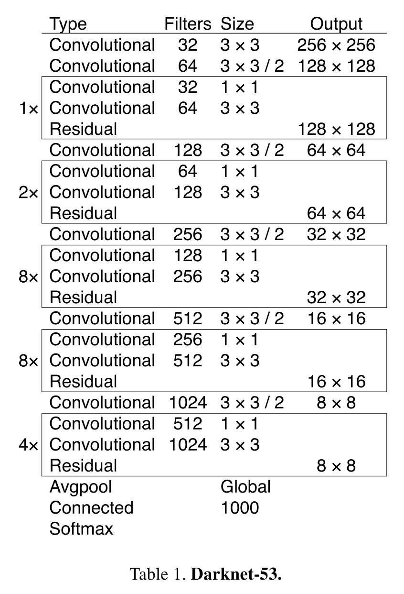

# YOLOv3

Date: Dec 1, 2020 → Dec 2, 2020
Status: 1회독완료

### 논문

---

[YOLOv3.pdf](images/YOLOv3.pdf)

### 이 논문의 한 줄

---

- YOLO v3는 v2버전을 더욱 개량한 것이다. 현재는 거의 모든 영역에서 사용되는 ResNet의 Residual Block이 v2버전에서는 존재하지 않았다. 그래서 레이어 신경망 층이 최근에 나온 연구보다는 상대적으로 얇았는데, v3에서는 이 기법을 사용해서 106개의 신경망 층을 구성함.

### keywords

---

- Object Detection
- Real-Time
- Anchor Box
- objectness score

### 내용정리

---

- **Feature Extractor** : DarkNet-53

- **loss function** : binary cross-entropy loss for the class predictions.
- **Not softmax, independent logistic classifier**: Using a softmax imposes the assumption that each box has precisely one class which is often not the case. A multilabel approach better models the data

### 문구

---

- YOLOv3 predicts an objectness score for each bounding box using logistic regression. This should be 1 if the bound- ing box prior overlaps a ground truth object by more than any other bounding box prior.
- our system only assigns one bounding box prior for each ground truth object.
- Each box predicts the classes the bounding box may contain using multilabel classification. We do not use a softmax as we have found it is unnecessary for good performance, instead we simply use an independent logistic classifier.
- Using a softmax imposes the assumption that each box has exactly *one class which is often not the case.* A ***multilabel approach better models the data.***
- take a feature map from earlier in the network and merge it with our upsampled features using concatenation. This method allows us to get ***more meaningful semantic information from the upsampled features*** and finer-grained information from the earlier feature map.
- still use k-means clustering to determine our bounding box priors.
- Our new network is a hybrid approach between the network used in YOLOv2, Darknet-19, and that newfangled residual network stuff.
- It has 53 convolutional layers so we call it.... wait for it..... Darknet-53
- We use multi-scale training, lots of data augmentation, batch normalization, all the standard stuff. We use the Darknet neural network framework for training and testing
- Focal loss 사용해보았다. 근데 오히려 안좋았다더라: We tried using focal loss. It dropped our
mAP about 2 points. YOLOv3 may **already be robust to the problem focal loss is trying to solve** because it has separate objectness predictions and conditional class predictions.

### 알고리즘 설명

---

### 기타

---

phone it in

(무언가에 더 이상 관심이 없고, 책임을 질 일도 없다는 것을 알기 때문에) 노력을 아주 조금만 한다.