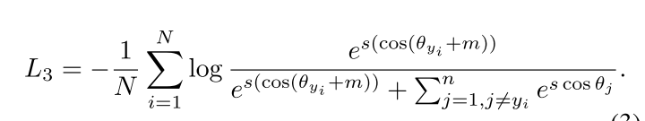

# ArcFace Loss _ ArcFace: Additive Angular Margin Loss for Deep Face Recognition

Date: Jan 5, 2021
Status: 1회독완료
분류: CV, DL, Face, Re-ID
요약: current feature 와 target weight 간의 $\theta$ 는 arccosine 함수로 구한다.
$\theta = \arccos{( \cos{\theta} )} = \arccos{( W^T x )}$
additive angular margin 을 target angle 에 더한다.
$x_i \ 와 W_{y_i}$ 사이의 additive angular margin penalty m 을 더해서 intra-class compactness 와 inter-class discrepancy 를 동시에 향상시킨다.
cosine function 을 통해 target logit 을 구한다.
그리고 고정된 feature norm 에 의해 모든 logit 을 re-scale 한다.
이후 과정은 softmax loss 와 같다.

구현도 쉽고 computational power 도 거의 추가로 필요로 하지 않는다.

3 단락 experiment 부분은 구현이 필요할 때 읽어보는걸로!

[link](https://www.notion.so/ArcFace-Loss-_-ArcFace-Additive-Angular-Margin-Loss-for-Deep-Face-Recognition-de0a3561723f40439a5d8d3a4808fd79)

### 논문

---

[https://arxiv.org/pdf/1801.07698.pdf](https://arxiv.org/pdf/1801.07698.pdf)

### code

---

[https://github.com/deepinsight/insightface](https://github.com/deepinsight/insightface)

### 이 논문의 한 줄

---

- current feature 와 target weight 간의 $\theta$ 는 arccosine 함수로 구한다.
    - $\theta = \arccos{( \cos{\theta} )} = \arccos{( W^T x )}$
- additive angular margin 을 target angle 에 더한다.
    - $x_i \ 와 W_{y_i}$ 사이의 additive angular margin penalty m 을 더해서 intra-class compactness 와 inter-class discrepancy 를 동시에 향상시킨다.
- cosine function 을 통해 target logit 을 구한다.
- 그리고 고정된 feature norm 에 의해 모든 logit 을 re-scale 한다.
- 이후 과정은 softmax loss 와 같다.

- 구현도 쉽고 computational power 도 거의 추가로 필요로 하지 않는다.

### keywords

---

- Face recognition (FR)
- Loss function
- inter-class , intra-class
- angular margin

### 내용정리

---

- a popular line of research is to incorporate margins in well-established loss functions( ex. Centre loss, SphereFace, ...) in order to maximize face class separability.
    - loss 짬뽕이 대세!
- 우리가 주장하는건...! ArcFace loss! : Additive Angular Margin Loss (ArcFace) to obtain highly discriminative features for face recognition.

### face recognition 을 위해 DCNN 을 학습하는 두 가지 큰 흐름

1. 각 사람을 하나의 class 로 보고 softmax classifier 같은걸로 학습
2. embedding 을 학습하기 위해 triplet loss 같은걸 사용.
- training 데이터가 많으면 두 방법 모두 결국 좋은 결과를 얻을 수 있음!
    - 근데, 각각 단점이 존재한다.
    - 우선, softmax 방법
        - identity 수 증가에 따른 matrix 사이즈 선형 증가
        - open-set 환경에 대응하지 못함.
    - 다음, triplet-loss 방법
        - 데이터 많아지면 pair 수가 기하급수적으로 증가!
        - hard sample mining 이 어렵다!

### ArcFace loss 가 뭐냐고? 요약

- current feature 와 target weight 간의 $\theta$ 는 arccosine 함수로 구한다.
    - $\theta = \arccos{( \cos{\theta} )} = \arccos{( W^T x )}$
- additive angular margin 을 target angle 에 더한다.
- cosine function 을 통해 target logit 을 구한다.
- 그리고 고정된 feature norm 에 의해 모든 logit 을 re-scale 한다.
- 이후 과정은 softmax loss 와 같다.
- current feature 와 target weight 간의 $\theta$ 는 arccosine 함수로 구한다.
    - $\theta = \arccos{( \cos{\theta} )} = \arccos{( W^T x )}$
- additive angular margin 을 target angle 에 더한다.
- cosine function 을 통해 target logit 을 구한다.
- 그리고 고정된 feature norm 에 의해 모든 logit 을 re-scale 한다.
- 이후 과정은 softmax loss 와 같다.

***장점은 크게 4 가지가 있다***

- Engaging:  exact correspondence between the angle and arc (각도와 호) 를 통해 geodesic distance margin 을 직접적으로 최적화한다.
- Effective: 10개의 FR benchmark 에 대해 성능 최고! (데이터 커도 그렇다!)
- Easy: Pytorch, Tensorflow 등의 환경에서 구현이 쉽고 코드 몇 줄로 구현 가능! 다른 loss function 과 합쳐질 필요가 없다!
- Efficient: 컴퓨팅 파워 추가로 필요한 부분 거의 없음.

### ArcFace loss 구체적 설명

- embedding feature 가 각 feature center 주위에 분포하기 때문에, $x_i \ 와 W_{y_i}$ 사이의 additive angular margin penalty m 을 더해서 intra-class compactness 와 inter-class discrepancy 를 동시에 향상시킨다.
- additive margin penalty m 이 normalized hypersphere 상의 geodesic distance margin penalty 와 동일하기 때문에, ArcFace 라고 이름지었다.

    

### 문구

---

### Abstract

- incorporate margins in well-established loss functions in order to maximize face class separability
- clear geometric interpretation due to the ex- act correspondence to the geodesic distance on the hypersphere.
- outperforms the state-of-the-art and **can be easily implemented** with negligible computational overhead.

### 1. Introduction

- [softmax loss 단점1] the size of the linear transformation matrix $W ∈ R^{d×n}$ increases linearly with the identities number n.
- [softmax loss 단점2] the learned features are separable for the closed-set classification problem but not discriminative enough for the open-set face recognition problem.
- [triplet loss 단점1] there is a **combinatorial explosion** in the number of face triplets especially for large-scale datasets, leading to a significant increase in the number of iteration steps
- [triplet loss 단점2] semi-hard sample mining is a quite difficult problem for effective model training ⇒ 이걸 해결하고자 [Hard Triplet Loss](https://arxiv.org/pdf/1703.07737.pdf) 를 주장한거있음!
- centre loss, the Euclidean distance between each feature vector and its class centre.
    - Nevertheless, updating the actual centers during training is extremely difficult as the number of face classes available for training has recently dramatically increased.
- weights from the last fully connected layer of a classification DCNN trained on the softmax loss bear conceptual similarities with the centres of each face class.
    - a multiplicative angular margin penalty to enforce extra intra-class compactness and inter-class discrepancy simultaneously.
- **Sphereface** introduced the important idea of **angular margin,** 하지만... unstable training
    - stability 를 개선하기 위해 .. a hybrid loss function which includes the standard softmax loss 제안 ⇒ 근데, the softmax loss dominates the training process
    - Sphereface: Deep hypersphere embedding for face recognition. CVPR 2017
- **CosFace** directly adds cosine margin penalty to the target logit.
    - ShpereFace 보다 더 구현하기 쉽고 성능도 좋더라~
- We utilize the arc-cosine function to calculate the angle between the current feature and the target weight. $\theta$ 구하는데 arccosine 함수 사용한다.
- directly optimizes the geodesic distance margin by virtue of the exact correspondence between the angle and arc in the normalized hypersphere.
- state-of-the-art performance on ten face recognition benchmarks including large-scale image and video datasets.
- extremely easy to implement in the computational-graph-based deep learning frameworks.
- only adds negligible computational complexity during training.

### 2. Proposed Approach

### 2.1. ArcFace

- add an additive angular margin penalty m between $x_i$ and $W_{y_i}$ to simultaneously
enhance the intra-class compactness and inter-class discrepancy.
- Since the proposed additive angular margin penalty is equal to the geodesic distance margin penalty in the normalized hypersphere, we name our method as ArcFace
- The geodesic distance gap between closest classes becomes evident as the additive angular margin penalty is incorporated

~~

### 3. Experiments

### 3.1.Implementation Details

구현할 때 읽어볼 필요 있음.

### 알고리즘 설명

---

 

we get the $cos θ_j$ (logit) for each class as $W^T_j x_i$. We calculate the arccosθyi and get the angle between the feature xi and the ground truth weight $W_{y_i}$

ArcFace loss can obviously enforce a more evident gap between the nearest classes.
The geodesic distance gap between closest classes becomes evident as the additive angular margin penalty is incorporated.

### 기타

---

hypersphere : 초구(超球) ((3차원보다 큰 차원으로 확장한 것))

arccosine : The arccosine of x is defined as the inverse cosine function of x when -1≤x≤1. When the cosine of y is equal to x: cos y = x. Then the arccosine of x is equal to the inverse cosine function of x, which is equal to y: arccos x = cos-1 x = y.