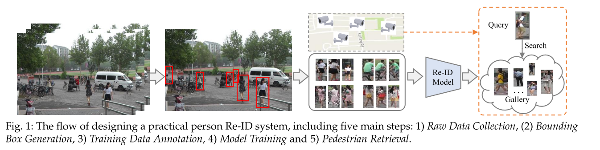

# Deep Learning for Person Re-identification: A Survey and Outlook

Date: Jan 4, 2021 → Jan 8, 2021
Status: 1회독완료
분류: CV, DL, Re-ID
요약: 너무 길다...본문 확인!

[link](https://www.notion.so/Deep-Learning-for-Person-Re-identification-A-Survey-and-Outlook-df1f6ee677cb4c70b8c52aa81d670910)

### 논문

---

[https://arxiv.org/pdf/2001.04193.pdf](https://arxiv.org/pdf/2001.04193.pdf)

### code

---

none

### 이 논문의 한 줄

---

- Person re-identification (Re-ID) aims at retrieving a person of interest across multiple non-overlapping cameras.
- closed settings vs open settings
    - Feature representation learning
    - Deep metric learning
    - Ranking Optimization
- ... 내용정리 \ 구문 참조

### keywords

---

- Person Re-Identification
- Pedestrian Retrieval
- Literature Survey
- Evaluation Metric
- Deep Learning

### 내용정리

---

### [Closed-world setting] 일반적으로 Re-ID 시스템 구축을 위해 필요한 5단계의 과정들

- Raw Data Collection : 각기 다른 위치에 존재하는 카메라들로부터 얻을 수 있는 영상 데이터
- Bounding Box Generation : detector 나 tracking algorithm 을 통해 Bbox 얻어내기
- Training Data Annotation : 상황 변화가 있으면, 상황에 따라서 다시 annotation 이 필요하기도 하다.
- Model Training : 위 단계에서 annotation 한 데이터를 통한 Re-ID 모델 학습.
- Pedestrian Retrieval : query image 와 Gallery set 이 주어진 상태에서, 위 단계에서 학습된 Re-ID 모델을 통해 feature  extraction 을 한다. 그리고 query image 와 gallery 간의 distance 를 통한 ranking list 를 만든다.

closed-world vs open-world setting에 따라서 Re-ID 구축을 위해 필요한 단계가 상이하다.

- Single-modality vs. Heterogeneous Data : closed setting 에서는 single-modality visible camera 들에 의해 얻어진 영상임. 하지만, open setting 실제 상황에서는 빛의 파장이 다르다던지, depth 가 다르다던지 등등 아무튼 다른 양상을 띄는 데이터를 얻어오기 쉬운 상황.
- Bounding Box Generation vs. Raw Images/Videos : closed 는 person appearance info 를 담고 있는 bbox 를 통해 train 및 test 가 이루어지지만, open은 그렇지 않아!
    - In contrast, some practical open-world applications require end-to-end person search from the raw images or videos.
- Sufficient Annotated Data vs. Unavailable/Limited Labels : closed 는 annotation 이 잘 된 데이터가 충분히 있다는 가정을 한다. 하지만, 그거 다 annotation 하려면 비용이 너무 많이 든다! 고로, 현실 문제에서는 annotation 이 조금 되어있거나 안되어있는 상황을 대응해야함.
- Correct Annotation vs. Noisy Annotation : closed 에서는 annotation 이 다 맞다는 가정으로 학습을 진행하지만, 실제로는 그렇지 않을 가능성이 높다!
    - 왜? annotation error 가 있거나 detection, tracking 이 잘 이루어지지 않을 수 있을 가능성.
    - 따라서 Open 에서는 이에 대응하기 위해 noise-robust Re-ID model training 과 같은 연구가 이루어지기도 한다.
- Query Exists in Gallery vs. Open-set : closed 에서는 query person 이 gallery set 에 있다는 가정을 하지만, open 에서는 그렇지 않을 확률이 더 높다.
    - However, in many scenarios, the query person may not appear in the gallery set , or we need to perform the verification rather than retrieval

### 문구

---

- Person re-identification (Re-ID) aims at retrieving a person of interest across multiple non-overlapping cameras.
- Given a query person-of-interest, the goal of Re-ID is to determine whether this person has appeared in another place at a distinct time captured by a different camera.
- Meanwhile, **we introduce a new evaluation metric (mINP) for person Re-ID**, indicating the cost of finding all the correct matches, which provides additional criteria to evaluate the Re-ID system for real applications.
- Person Re-ID is a challenging task due to the presence of different viewpoints _ resolutions, illuminations, poses, occlusions, heterogeneous modalities, etc.
    - heterogeneous modality?? 대충 multimodal 이라는 의미인듯.
    - Modality refers to **the way in which something happens or is experienced** and a research problem is characterized as multimodal when it includes multiple such modalities.
- We design a new powerful AGW baseline and a new evaluation metric (mINP).
- Unless otherwise specified, person Re-ID in this survey refers to the pedestrian retrieval problem across multiple surveillance cameras, from a computer vision perspective.

### 2. Closed-world person Re-ID

- Typically, a standard closed-world Re-ID system contains three main components
    - Feature Representation Learning, Deep Metric Learning, Ranking Optimization.

### 2.1. Feature Representation Learning

- 4 가지 큰 분류가 존재한다.

- Global Feature : 각 사람 하나씩 통째로 학습.
    - global feature learning is the primary choice when integrating advanced deep learning techniques into the person Re-ID field in the early years.
    - **ID-discriminative Embedding (IDE) model**: the training process of person Re-ID as a multi-class classification problem by treating each identity as a distinct class. It is now widely used in the Re-ID community.
    - **Attention Information**
        - attention within the person image
        - attention across multiple person images
    - **Architecture Modification**
        - pass
- ***Local Feature*** : 한 사람을 쪼개서 학습.
    - usually learns part/region aggregated features, making it robust against misalignment variations.
    - The main trend is to combine full-body representation and local part features.
    - An attention-aware feature composition module is also designed to aggregate the part level features.
    - 쪼갠걸 이어서 판단하려는 노력도 있었다.
- ***Auxiliary Feature*** : 부가 정보를(나이 등) 추가하여 학습!
    - usually requires additional annotated information (e.g., semantic attributes ) or generated/augmented training samples to reinforce the feature representation.
    - **Semantic Attributes : 나이같은거...**
        - Both the semantic attributes and the attention scheme are incorporated to improve part feature learning.
        - They are also leveraged as the auxiliary supervision information in unsupervised learning.
    - **Viewpoint Information : 각 카메라가 바라보는 화각에 대한 정보**
        - identity-discriminative and view-invariant feature representations at multiple semantic levels
        - combination of view-generic and view-specific learning.
    - **Domain Information** : ㅇㅎ... 카메라 하나가 바라보는 영역을 domain 으로 가정하고, 그 정보를 활용할 수도 있겠네.
        - adaptively mine the domain-sharable and domain-specific neurons for multi-domain deep feature representation learning.
        - Consistent-aware deep learning for person re-identification in a camera network(CVPR)
    - **Generation/Augmentation** : augmented or GAN 으로 만들어진 이미지를 추가적으로 활용.
        - use of augmented/GAN generated images as the auxiliary information
        - It improves the supervised feature representation learning with the generated person images.
            - pose constraint 를 포함한 시도도 존재하였다. (Pose transferrable person re-identification, CVPR 2018)
            - pose normalized image generation 시도도 존재하였고! ( Pose-normalized image generation for person re-identification , ECCV )
            - 근데... 현실적으로 pose 를 다 잡아낼 수 없는 상황이라면?? 길거리에도 장애물들로 인해 사람들의 Pose 가 많이 가려져있을 수도 있잖아.
        - Using the GAN generated images is also a widely used approach in unsupervised domain adaptation Re-ID**.**
            - Image- image domain adaptation with preserved self-similarity and domain-dissimilarity for person re-identification, CVPR 2018
            - Cross-dataset person re-identification via unsupervised pose disentanglement and adaptation, ICCV 2019
        - random erasing, random box drop(DropBlock), different illumination, etc.
            - 여러 시도가 있었다... 모델의 generalizability 를 향상시키는데 기여한다!
        - A deep group- shuffling random walk framework is presented.
            - Deep group-shuffling random walk for person re-identification, CVPR 2018
        - Similarity-Guided Graph Neural Network (SGGNN)
            - Person re-identification with deep similarity-guided graph neural network, ECCV 2018
- **Video Feature** : 연속된 frame 의 정보를 통해 학습
    - **temporal information** is unreliable in an unconstrained tracking sequence.
        - 고로... To accurately and automatically capture the temporal information, a recurrent neural network architecture is designed for video-based person Re-ID.
    - **LSTM** 을 활용한 방법도 진행되었었다.
        - present a progressive/sequential fusion framework to aggregate the frame-level human region representations, using a Long Short Term Memory (LSTM) network, yielding a video- level feature representation
        - Person re-identification via recurrent feature aggregation, ECCV 2016
    - Since video sequences usually contain unavoidable outlier tracking frames, employing an attention scheme is also a popular approach to eliminate the effect. 오호... **attention module** 을 활용한 방법도 고안되었다!
        - salient features across multiple video frames with mutual consensus estimation.
            - 흠... 두드러지는 feature 를 찾아내는 것이 결국 선택과 집중을 이루어내어... 더 좋은 결과를 내는 것 아닐까 하는 생각! Co-segmentation inspired attention networks for video-based person re-identification, ICCV 2019
        - a diversity regularization is employed to mine multiple discriminative body parts in each video sequence.
            - Diversity regularized spatiotemporal attention for video-based person re-identification, CVPR 2018
- **Architecture Design** : 백본을 바꿔보자!!
    - Some works have tried to modify the backbone architecture to achieve better Re-ID features.
    - pass

### 2.2. Deep Metric Learning : DL 에서 loss function 디자인의 역할이 크게 작용하는 중이다!!

- The role of **metric learning has been replaced by the loss function designs** to guide the feature representation learning.l

### 2.2.1. Loss Function Design : review the widely used loss functions

- 여러 loss function design 에 대한 설명. three widely studied loss functions with their variants in the literature for person Re-ID, including the **identity loss, verification loss and triplet loss.**

    

- Identity Loss
    - treats the training process of person Re-ID as an image classification problem.
    - $L_{id} = −1/n\sum^n_{i=1} log(p(y_i|x_i))$
    - softmax loss 관련 연구
        - Deep cosine metric learning for person re-identification , WACV 2018
        - label smoothing : generally integrated into the standard softmax cross-entropy loss
            - Unlabeled samples generated by gan improve the person re-identification baseline in vitro.
- Verification Loss
    - optimizes the pairwise relationship, either with a contrastive loss or binary verification loss.
    - The contrastive loss improves the relative pairwise distance comparison
        - $L_{con} = (1 − δ_{ij}){max(0, ρ − d_{ij})}^2 + δ_{ij}d^2_{ij}$
            - $d_{ij}$ : Euclidian distance between the embedding features of two input samples $x_i \ and \  x_j$
            - $\delta_{ij}$: binary label indicator ($x_i, x_j$ 가 같은 identity 에 속하면 1 , 아니면 0 )
            - p : margin parameter
    - binary verification
        - a differential feature $f_{ij}$ is obtained by $f_{ij}$ = ($f_i$ − $f_j$)2
        - $p(δ_{ij}|f_{ij})$ to represent the probability of an input pair ($x_i \ and\  x_j$) being recognized as $δ_{ij}$ (0 or 1)
        - verification loss

        

        - identity loss 와 합쳐 사용하여 performance 상승을 꽤하기도 한다.
            - Group consistent similarity learning via deep crf for person re-identification, CVPR 2018, etc.
- Triplet loss
    - treats the Re-ID model training process as a **retrieval ranking problem**.
    - the distance between the positive pair should be smaller than the negative pair by a pre-defined margin.
    - $x_i : anchor \  sample,\ x_j :same \ identity ,\ x_k : negative \ sample$
    - The triplet loss with a margin parameter
        - $L_{tri}(i, j, k) = max(ρ + d_{ij} − d_{ik}, 0)$
    - various informative triplet mining methods have been designed
        - hard-triple loss 도 이 중에 하나 아닐까??
        - 그렇네! In defense of the triplet loss for person re-identification, arXiv 2017
    - quadruplet deep network 도 있다! : one positive sample and two mined negative samples
        - Beyond triplet loss: a deep quadruplet network for person re-identification, CVPR 2017
- OIM loss
    - 우선 pass

### 2.2.2 Training strategy : summarize the training strategies with specific sampling designs

- batch sampling : 특히 triplet-loss with hard mining 을 사용하는 환경에서 중요한 역할을 한다.
    - Meanwhile, the severely imbalanced positive and negative sample pairs increase the additional challenges for the training strategy.

        ⇒ 근데... sampling 이 imbalance 하게 되면!! 문제가 생긴다 이거지! 그래서 class imbalance 를 해결하기 위한 방법들이 있다.

    - 가장 흔히 이용되는 방법은 identity sampling
        - 각 batch 마다, identity 몇 가지를 random 하게 고른다. 각 identity 마다 이미지 몇 장을 추출한다. 추출된 이미지가 training batch 를 형성.
    - Sample Rate Learning (SRL) 이라는 방법도 있음.
        - Person re-identification with cascaded pairwise convolutions , CVPR 2018

            ⇒ BraidNet 이라는걸 주장하기도 하였네... 중요하진 않은듯??

    - adaptive weighted triplet loss
    - focal loss scheme is also investigated
    - curriculum sampling strategy
    - hard sample mining method with weighted complete bipartite graph matching
        - Mvp matching: A maximum-value perfect matching for mining hard samples, with application to person re-identification, ICCV 2019
    - multi-loss 관점에서, 섞는 노력도 이루어졌다!: reweights the identity loss and triplet loss, extracting appropriate components shared between them.

### 2.3. Ranking Optimization

- plays a crucial role in improving the retrieval performance in the testing stage.
- optimizes the ranking order, either by automatic gallery-to-gallery similarity mining or human interaction.
- Rank/Metric fusion is another popular approach.
    - Learning to rank in person re-identification with metric ensembles, CVPR 2015
    - Re-ranking via metric fusion for object retrieval and person re-identification, CVPR 2019

### 2.3.1. Re-ranking

- basic idea : utilize the gallery-to- gallery similarity to optimize the initial ranking list.

- top-ranked similarity pulling and bottom-ranked dissimilarity pushing
- re-ranking method with k-reciprocal encoding which mines the contextual information
    - ***Re-ranking person re-identification with k-reciprocal encoding, CVPR 2017***
    - Due to its simplicity and effectiveness, it has been widely used in current state-of-the-art to boost the performance. ⇒ 얘는 꼭 해보자!
- cross neighborhood re-ranking
- **Query Adaptive : the query adaptive retrieval strategy to replace the uniform searching engine to improve the performance**
    - Efficient online local metric adaptation via negative samples for person re-identification, ICCV 2017
- **Human Interaction: using human feedback to optimize the ranking list**
    - pass!

### 2.3.2 Ranking Fusion

- exploits multiple ranking lists obtained with different methods to improve retrieval performance.
- A rank aggregation method by employing the similarity and dissimilarity.
    - Person reidentification via ranking aggregation of similarity pulling and dissimilarity pushing, IEEE 2016
- Unified Ensemble Diffusion (UED) is recently designed for metric fusion.
    - maintains the advantages of three existing fusion algorithms, optimized by a new objective function and derivation
    - ***Re-ranking via metric fusion for object retrieval and person re-identification, CVPR 2017***
        - 얘는 또 등장하네! 꼭 해보자.
- 혹은 metric ensemble!
    - ***Learning to rank in person re-identification with metric ensembles, CVPR 2016***
        - 얘도 또 등장하네!

### 2.4. Datasets and Evaluation

Jan 6, 2021 start!

### 2.4.1. Datasets and Evaluation Metrics

- **Datasets**
    - dataset이 뭐 대충 엄청 크기가 증가했더라~
- **Evaluation Metrics**
    - CMC : Cumulative Matching Characteristics
        - CMC is accurate when only one ground truth exists for each query since it only considers the first match in the evaluation process.
        - 하지만 gallery set 에 보통 여러개의 GT 가 존재하기 때문에... 여러 카메라가 있는 상황에서 분별력을 잘 갖출 수 있다고 판단될 수는 없다.
    - mAP : mean Average Precision
        - measures the average retrieval performance with multiple grountruths.
        - first GT 는 잘 찾지만 다른 hard match 에서는 성능이 떨어지는 측면을 설명할 수 있는 지표.
    - CMC-k : Rank-k matching accuracy
        - probability that a correct match appears in the top-k ranked retrieved results.
    - 최근에 both mAP and CMC as the evaluation metrics 을 사용하는 경향을 보이더라!
    - 모델이 복잡해지면서 FLOP 을 표시하기도 한다고 함...오호
- State-of-The-Arts
    - Image-based Re-ID

        

        - part-level feature learning is beneficial for discriminative Re-ID model learning.
            - ㅇㅎ... part 로 쪼개는게 효과가 있는것으로 보인다.
            - When the person images suffer from large background clutter or heavy occlusions, part-level feature learning usually achieves better performance by mining discriminative body regions.
            - occlusion 에 대응하기 위해... features aggregation paradigm, combining the part-level and full human body features
        - attention is beneficial for discriminative Re-ID model learning.
        - multi-loss training can improve the Re-ID model learning
    - Video-based Re-ID
        - pass

### 3. Open-world person re-identification

### 3.1. Heterogeneous Re-ID

four main kinds of heterogeneous Re-ID (3.1.1 ~ 3.1.4)

### 3.1.1. Depth-based Re-ID

- Depth images capture the body shape and skeleton information.
    - possibility for Re-ID under illumination/clothes changing environments
- RGB 데이터셋 활용 시도
- 두가지 합친 시도: the combination of RGB and depth information to improve the Re-ID performance, addressing the clothes-changing challenge.

### 3.1.2. Text-to-Image Re-ID

- Text-to-image Re-ID addresses the matching between a text description and RGB images.

### 3.1.3. Visible-Infrared Re-ID

- Visible-Infrared Re-ID handles the cross-modality matching between the daytime visible and night-time infrared images.
- 어두운 상황에서 분석을 해야한다면 유용할 수 있다.
- 여기다가 GAN 을 적용하는 시도도 있었다. GAN은 여기저기서 다 등장하는구만!

### 3.1.4. Cross-Resolution Re-ID

- Cross-Resolution Re-ID conducts the matching between low-resolution and high-resolution images, addressing the large resolution variations.
- 카메라간 해상도 차이가 큰 경우에 유용할 수 있는 방법.

### 3.2. End-to-End Re-ID

- End-to-end Re-ID alleviates the reliance on additional step for bounding boxes generation.
- person Re-ID from raw images or videos, and multi-camera tracking.
- **Re-ID in Raw Images/Videos**
    - two stage , one stage
    - searching for the person from raw videos with text description
- **Multi-camera Tracking**
    - End-to-end person Re-ID is also closely related to multi-person, multi-camera tracking
    - 학습의 한 방법: learn the correlation between the multi-target multi-camera tracking and person Re-ID by hard-identity mining and adaptive weighted triplet learning.
    - a locality aware appearance metric (LAAM) with both intra- and inter-camera relation modeling is proposed. ㅇㅎ... Locality aware...
        - Locality aware appearance metric for multi-target multi-camera tracking, arxiv 2019

### **3.3. Semi-supervised and Unsupervised Re-ID**

### 3.3.1. Unsupervised Re-ID

- Without cross-camera labels, early unsupervised Re-ID mainly learns invariant components.
- dictionary, metric, or saliency (두드러진 것...?), which leads to limited discriminability or scalability.
- (카메라 자체의 환경 값을 학습하는 경향이 있다. 카메라 안에 움직이는_변하는 사람을 바라보며 학습해야하는데 그렇지 않다는거지!)

- cross-camera label estimation is one of the popular approaches.
- A robust anchor embedding method iteratively assigns labels to the unlabelled tracklets to enlarge the anchor video sequences set... 'estimated labels'??
- For end-to-end unsupervised Re-ID, an iterative clustering and Re-ID model learning.
- A Tracklet Association Unsupervised Deep Learning (**TAUDL**) framework
    - Unsupervised person re- identification by deep learning tracklet association, ECCV 2018
    - The main idea is to jointly conduct the within-camera tracklet association and model the cross-camera tracklet correlation.
    - 비슷한 맥락에서... an unsupervised camera-aware similarity consistency mining method is also presented in a coarse-to-fine consistency learning scheme
        - Unsupervised person re-identification by camera-aware similarity consistency learning, ICCV 2019
- *semantic attributes* are also adopted in unsupervised Re-ID.
    - A Transferable Joint Attribute-Identity Deep Learning (**TJ-AIDL**) framework is introduced
        - incorporates identity-discriminative and semantic attribute feature learning in a two-branch network
        - Transferable joint attribute-identity deep learning for unsupervised person re-identification, CVPR 2018
- *learn a part-level representation*
    - A PatchNet is designed to learn discriminative patch features by mining patch level similarity.
    - The self-similarity Grouping (SSG) approach iteratively conducts grouping (exploits both the global body and local parts similarity for pseudo labeling) and Re-ID model training in a self-paced manner.
- **Semi-supervised Re-ID**
    - With limited label information, a one-shot metric learning method ~~
    - 흠... 근데 만약 label 이 없는 상황을 자주 접해야 하는 환경이라면... 이건 쓸모가 없겠군
        - Pass

### 3.3.2. Unsupervised Domain Adaptation

- *Unsupervised domain adaptation (`UDA`)* transfers the knowledge on a labeled source dataset to the unlabeled target dataset ... another popular approach for unsupervised Re-ID without target dataset labels!
    - 라벨링된 데이터셋에 의해 얻어낸 결과를 라벨링 되지 않은 target 데이터셋 (풀고자 하는 데이터셋) 에 transfer??! GAN 을 통한다. ***흠... 이거 해볼만 한거같다.***
- **Target Image Generation**
    - Using GAN generation to transfer the source domain images to target-domain style is a popular approach for UDA Re-ID.
    - The generated images enable supervised Re-ID model learning in the unlabeled target domain.
    - handle the **domain gap problem** by proposing a Person Transfer Generative Adversarial Network (**PTGAN**), transferring the knowledge from one labeled source dataset to another unlabeled target dataset.
    - similarity preserving generative adversarial network (SPGAN)
- **Target Domain Supervision Mining**
    - directly mine the supervision on the unlabeled target dataset.
        - 잉...? 라벨링이 없는 데이터에서 supervision 을 어떻게 한다는거지.
            - exemplar memory learning scheme
                - Invariance matters: Exemplar memory for domain adaptive person re-identification, CVPR 2019
            - Domain-Invariant Mapping Network (DIMN)
        - The spatiotemporal information is also utilized as the supervision in **TFusion**

### 3.3.3. SOTA Unsupervised Re-ID

- SSG
    - Self-similarity grouping: A simple unsupervised cross domain adaptation approach for person reidentification, ICCV 2019
- Unsupervised Re-ID 발전 가능성
    - 1) The powerful attention scheme in supervised Re-ID methods have rarely been applied in unsupervised Re- ID.
    - 2) Target domain image generation has been proved effective in some methods, but they are not applied in the two best methods.
    - 3) Using the annotated source data in the training process of the target domain is beneficial for cross-dataset learning, but it is also not included in above two methods.

### 3.4 Noise-Robust Re-ID

- Partial Re-ID
    - addresses the Re-ID problem with heavy occlusions.
        - 오호... occlusion 이 심한 환경에서 활용할 수 있는 방법에 대한 고민이라...
- Re-ID with sample noise, label noise
    - pass

### 3.5 Open-set Re-ID

- 옛날에는 사람이 직접 만든 방법을 하기도 했는데... 뭐 그건 옛날 이야기니까 넘어가고
- For deep learning methods, an **Adversarial PersonNet** (APN) is proposed, which jointly learns a GAN module and the Re-ID feature extractor.
    - Adversarial open-world person re-identification, ECCV 2018
    - 2018년에 GAN 관련 논문이 진짜 엄청 쏟아지긴 했나보구나... 엄청많네

## 4. An Outlook: Re-ID in Next Era

### 4.1. mINP : new evaluation metric

- NP : negative penalty

- $R^{hard}_i$ indicates the rank position of the hardest match
- |$G_i$| represents the total number of correct matches for query i
- 즉, 어려운 hard pair 에 속하는 것들 중, 맞추지 못한 비율만큼 패널티를 주는 방식

### 기타

---

***Multimodal Deep Learning***

Example of Multimodal deep learning where different types of NN are used to extract features

The most common method in practice is to combine high-level embeddings from the different inputs by concatenating them and then applying a softmax

⇒ 하지만... 각각의 modality를 똑같이 취급하면 안된다는거지!

⇒ The problem with this approach is that it would give an equal importance to all the sub-networks / modalities which is highly unlikely in real-life situations. 

***CMC (cumulative match characteristic)***

[https://www.ee.cuhk.edu.hk/~xgwang/papers/wangDSRT07iccv_final.pdf](https://www.ee.cuhk.edu.hk/~xgwang/papers/wangDSRT07iccv_final.pdf)

hull : (배의)선체, (콩 등의)깍지를 벗기다, 겉껍칠, 덮개

in vitro : 체외에서 진행되는 _ ex. an egg fertilized in vitro

hard ~~ : 여기서 hard 라고 쓰이는건 말 그대로 '어려운' 데이터를 의미한다! triplet loss 에서 positive pair 중 거리가 먼 pair 를 찾고, negative pair 중 거리가 가까운 pair 를 찾아서 학습시키면, 이건 훨씬 더 어려운 문제에 대해 대응할 수 있는(robust) 모델을 만들어내는 것이기 때문에! hard training 시킨다고 이해하면 될듯. **극기훈련!** **혹한기!** ㅋㅋㅋ