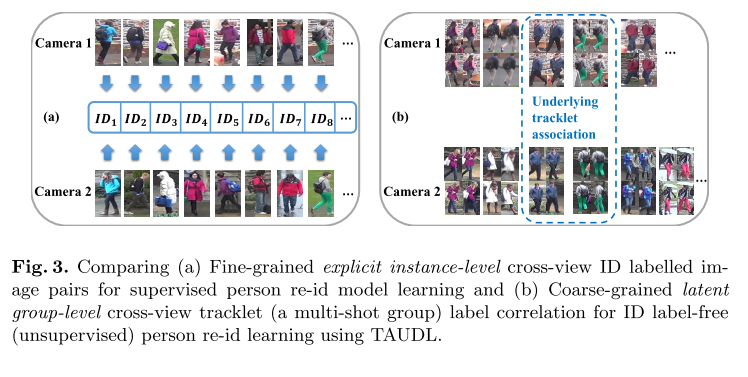

# TAUDL _ Unsupervised Person Re-identification by Deep Learning Tracklet Association

Date: Jan 11, 2021
Status: 1회독완료
분류: CV, DL, ML, Re-ID
요약: SSTT : 중복 tracklet 발생하는 것을 막기 위해, sampling 에 간격을 두는 것.(temporal) 그리고 같은 공간 안에서 함께 등장하면서 거리가 떨어져있는 tracklet 들을 고름.

카메라 하나에서 잘하도록 만들기 (local) \ 여러 카메라에서 잘하도록 만들기 (global) 혼합
(1) Per-Camera Tracklet Discrimination (PCTD) Learning
(2) Cross-Camera Tracklet Association (CCTA) Learning

[notion link](https://www.notion.so/bluecandle/TAUDL-_-Unsupervised-Person-Re-identification-by-Deep-Learning-Tracklet-Association-973b3751311248339d6853c9edd238bf)

### 논문

---

[https://arxiv.org/pdf/1809.02874.pdf](https://arxiv.org/pdf/1809.02874.pdf)

### code

---

### 이 논문의 한 줄

---

- SSTT : 중복 tracklet 발생하는 것을 막기 위해, sampling 에 간격을 두는 것.(temporal) 그리고 같은 공간 안에서 함께 등장하면서 거리가 떨어져있는 tracklet 들을 고름.
- 카메라 하나에서 잘하도록 만들기 (local) \ 여러 카메라에서 잘하도록 만들기 (global) 혼합
    - (1) Per-Camera Tracklet Discrimination (PCTD) Learning
    - (2) Cross-Camera Tracklet Association (CCTA) Learning

### keywords

---

- Person Re-Identification
- Unsupervised Learning
- Tracklet
- Surveillance Video

### 내용정리

---

- 논문에서 풀고자 하는 문제: supervised 방식이 현실의 문제를 해결하기에는 한계가 있다. 고로 unsupervised! 하지만, unsupervised 방법은 supervised 에 비해 성능이 너무 안좋다!
- 라벨링이 있는 source 데이터에서 view-invariant representation 을 학습한 이후, 모델을 unlabelled target data 에 적용하는 방식은 soruce 와 target이 공통된 cross-view characteristic 을 공유한다는 것을 전제로 하는데, 사실 그렇지도 않다!
- 

### 문구

---

### 1. Introduction

- jointly learning per-camera (within-camera) tracklet association (labelling) and cross-camera tracklet correlation by maximising the discovery of most likely tracklet relationships across camera views.
- because the lack of cross-view pairwise ID labelled data deprives a model's ability to learn from strong cointextual ID discriminative information in order to cope with ~~
- first learn a “view-invariant” representation from ID labelled source data, then adapt the model to a target domain by using only unlabelled target data ... implicit assumption that the source and target domains share some common cross-view characteristics and a view-invariant rep- resentation can be estimated, which is not always true.
- we consider a pure unsupervised person re-id deep learning problem.
- two key innovations
    - (1) **Per-Camera Tracklet Discrimination** Learning that optimises “local” within-camera tracklet label discrimination for facilitating cross-camera tracklet association given per-camera independently created tracklet label spaces. 일단 카메라 한 대 안에서 tracklet 구분 잘하기
    - (2) **Cross-Camera Tracklet Association** Learning that maximises “global” cross-camera tracklet label association. This is formulated as to maximise jointly cross-camera tracklet similarity and within-camera tracklet dissimilarity in an end-to-end deep learning framework. 여러대 카메라 있는 상황에서 잘하기.

### 3. Unsupervised Deep Learning Tracklet Association

- uniquely exploiting per- son tracklet labelling obtained by an unsupervised tracklet formation (sampling)
- we first present a data sampling mechanism for unsupervised within-camera tracklet labelling \ and then describe our model design for cross-camera tracklet association by joint unsupervised deep learning.

### 3.1. Unsupervised Within-View Tracklet Labelling

- we need an automatic tracklet labelling method to minimise the person ID duplication
- **Sparse Space-Time Tracklet (SSTT)** sampling and label assignment method.
- **[Temporal Sampling]**
- 카메라에 잡힌 이동하는 사람들의 세 가지 특징
    - **factor (1)** : For most people, re-appearing in a camera view is rare during a short time period.
        - 실제로는 하나의 tracklet 이 여러개로 인식되는 것이 문제니까...
        - we perform sparse temporal sampling of tracklets ⇒ 그림 2 (a)
        - At the i-th temporal sampling instance corresponding to a time point $S_i$, we retrieve all tracklets at time $S_i$ and annotate each tracklet with a distinct label. This is based on the **factor (2)**
    - **factor (2)** : peoplie co-occurring at the same time in a single-view but at different spatial locations should have distinct ID labels.
        - Given a time gap P, the next ((i + 1)-th) temporal sampling and label assignment is repeated, where P controls the sparsity of the temporal sampling rate.
            - P 값을 기준으로 interval 조절 (sparsity)
    - **factor (3)** : most people in a public scene travel through a single camera view in a common time period Q < P, it is expected that at most one tracklet per person can be sampled at such a sparse temporal sampling rate (assuming no re-appearing once out of the same camera view) ⇒ 띄엄띄엄 해도 tracklet 하나는 건질 수 있다.
    - reduce the ID duplication even in highly crowded scenes with greater.
- **[Spatial sampling]** 더 좋은 효과를 내기 위해... only selecting the co-occurring tracklets distantly distributed over the scene space. ⇒ 먼 거리에 분산되어있는, 함께 등장하는 tracklet 만을 선택한다.
    - the tracklet labels are more likely to be of independent person identities with minimum ID duplications in each i-th temporal sampling instance.
- we can obtain an independent set of labelled tracklets {$S_i, y_i$} per-camera in a camera network

### 3.2. Unsupervised Tracklet Association

- tracklet label re-id discriminative learning without person ID labels in a conventional classification deep learning framework ⇒ **Tracklet Association Unsupervised Deep Learning** (TAUDL) model (figure 1)
- optimise jointly both local tracklet within-view discrimination and global tracklet cross-view association.
- (1) Per-Camera Tracklet Discrimination (PCTD) Learning : local
    - instead of relying on the conventional fine-grained explicit instance-level cross-view ID pair- wise supervised learning (Fig. 3(a)), we learn to **maximise coarse-grained latent group-level cross-camera tracklet association** by set correlation (Fig. 3(b)).

    

    - we have a total of T different tracklet classification tasks each corresponding to a specific camera view.
    - formulate these T classification tasks in a **multi-branch architecture design** where every task shares the same feature representation whilst enjoys an individual classification branch (Fig. 1(b)) _ share + individual
    - we adopt the softmax Cross-Entropy (CE) loss function to optimise the corresponding classification task (the t-th branch).
    - **x** specifies the feature vector of I extracted by the task-shared feature representation component and $W_y$ the y-th class prediction function parameters.
    - Given a mini-batch, we compute the CE loss for each such training sample w.r.t. the respective tracklet label space and utilise their average to form the model learning supervision as:

        

    - when jointly learning all the per-camera tracklet discrimination tasks together, the learned representation model is somewhat implicitly and colletively cross-view tracklet discriminative in a latent manner, due to the existence of cross-camera tracklet correlation.
    - the shared feature representation is optimised concurrently to be discriminative for tracklet discrimination in multiple camera views, therefore **propagating model discriminative learning from per-camera to cross-camera**.
        - ㅇㅎ... 결론적으로 per-camera 에서 학습하는 것이 global에도 implicit 하게 영향을 준다는 주장

- (2) Cross-Camera Tracklet Association (CCTA) Learning : global
- (1) 에서 implicit 하게 global 학습하는거말고, explicit 하게 학습하는 장치의 필요성!
- the idea of batch-wise incrementally aligning cross-view per tracklet feature distribution in the shared multi-task learning feature space.
- we want to estab- lish for each in-batch tracklet a discriminative association with other tracklets from different camera views.
- person identity pairwise labeling 이 없기 때문에...
    - we propose to align *similar* and *dissimilar* tracklets in each mini-batch given the up-to-date shared multi-task (multi-camera) feature rep- resentation from optimising PCTD
    - tracklet 각각에 대해, 가장 가까운 K 개의 cross-view tracklet 을 선정하고($N^t_i$ ) 이걸 tracklet 에 가깝게 끌어당기면서, 동시에 답이 아닌 친구들은 멀어지게 만드는 loss
        - ⇒ 이거 그냥 triplet loss 아님??

        

- similar to the Histogram Loss in terms of distribution alignment. However, the Histogram Loss is a supervised loss that requires supervised label training data, whilst the CCTA is purely unsupervised and derived directly from feature similarity measures.

- PCTD 와 CCTA 를 합친다. $\lambda$ 값은 weighting param

- image dataset 에 대해 TJ-AIDL 프레임워크 (이것도 봐보려고 했는데 안 봐도 되겠네) 보다 좋은 성능을 보여줌

### 알고리즘 설명

---

### 기타

---

- SSTT : 중복 tracklet 발생하는 것을 막기 위해, sampling 에 간격을 두는 것.(temporal) 그리고 같은 공간 안에서 함께 등장하면서 거리가 떨어져있는 tracklet 들을 고름.
- 카메라 하나에서 잘하도록 만들기 (local) \ 여러 카메라에서 잘하도록 만들기 (global) 혼합
    - (1) Per-Camera Tracklet Discrimination (PCTD) Learning
    - (2) Cross-Camera Tracklet Association (CCTA) Learning