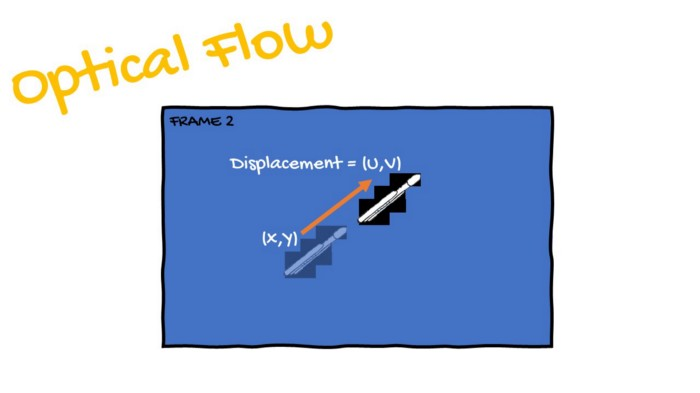

# Deep SORT

Date: Dec 11, 2020
Property: DL, Tracker
Status: 1회독완료

[정리원본](https://www.notion.so/Deep-SORT-1326abb9302e4b40bedab5fa658eafd4)

### 논문

---

[https://arxiv.org/abs/1703.07402](https://arxiv.org/abs/1703.07402)

### code

---

[https://github.com/nwojke/deep_sort](https://github.com/nwojke/deep_sort)

### 이 논문의 한 줄

---

Re-ID 데이터셋을 통해 pretrain 된, motion 과 appearance 정보를 담고 있는 Metric 으로 data association metric 을 대체한다. 그리고 이는 occlusion 에 취약할 수 있는 SORT 의 약점을 개선하는 것에 기여 하였다.(identity switch 수를 45% 감소) 그리고, 다른 변화(Mahaloanobis distance 사용 등)를 통해 high fps 에서도 좋은 성능을 보여주었다.

### keywords

---

- Computer Vision
- Multiple Object Tracking
- Data Association
- Mahalanobis distance
    - The Mahalanobis distance is a measure of the distance between a point P and a distribution D.
    - multi-dimensional generalization of the idea of measuring how many standard deviations away P is from the mean of D

### 내용정리

---

[https://riteshkanjee.medium.com/deepsort-deep-learning-applied-to-object-tracking-924f59f99104](https://riteshkanjee.medium.com/deepsort-deep-learning-applied-to-object-tracking-924f59f99104)

- while detection works great for single frames, there needs to be **a correlation of tracked features between sequential images of the video**. Otherwise any sort of occlusion, you will lose detection and Your target may slip out of the frame.
- 기존 접근 중 하나 _ mean shift: 다음 프레임에 이동해있을 예상 구역 안에서 target 을 찾아내는 방식.
- 기존 접근 중 하나 _ optical flow: if your object is moving at a certain velocity, you will be able to use these motion vectors to track and even predict the trajectory of the object in the next frame.

- the ball travels behind a box which occludes the ball. How do you track something that you can’t see? Well this is where the Kalman comes in. Assuming a constant velocity model and gaussian distribution.

### 일단 SORT 설명부터 (이미 SORT 읽었지만 이 사람 설명도 다시 읽어봄)

- we need to propagate the detections from the current frame to the next using a linear constant velocity model.
- When detection is associated with a target, the detected bounding box is used to update the target state where the velocity components are optimally solved via the Kalman filter framework. (논문에 쓰인 문장 그대로네)
- However, if no detection is associated to the target, its state is simply predicted without correct using the Linear velocity model. (이것도 그대로)

### 그렇다면, SORT 랑 DEEP SORT 랑 뭐가 그렇게 다른건데?

일단 이름을 보면, SORT with deep association metric 임!

⇒ 즉, deep association metric 이 뭔지 알아보면 되겠지??

- 그냥 SORT 가 좋은 성능을 보여주기는 하지만... despite the effectiveness of Kalman filter, it returns a relatively high number of identity switches and has a deficiency in tracking through occlusions and different viewpoints etc..
    - to improve this, the authors of DeepSORT introduced another **distance metric based on the “appearance” of the object**.
    - ㅇㅎ... object 의 appearance 에 기반한 거리 metric 을 도입하였다. 여기서 appearance 가 외형인걸까 아니면 말 그대로 '등장' 이런걸까 외형이겠지?

***Appearance Feature Vector***

- ***This feature vector is known as the appearance descriptor.***

- classification 되기 전에 feature extracting 된 상태의 벡터가 appearance descriptor 라는거지.
    - [1] after the appearance descriptor is obtained the by the authors
    - [2] use **nearest neighbor queries** in the visual appearance to establish the measurement-to-track association.
    - [3] Measurement-to-track association or MTA is the process of determining the relationship between a measurement and an existing track.
    - [4] So now we use the **Mahalanobis distance** as oppose to the Euclidean distance for MTA
- Deep extension to the SORT algorithm shows a reduced number of identity switches by 45% achieved an over competitive performance at high frame rates.

### 문구

---

- Due to this extension we are able to track objects through longer peri- ods of occlusions, effectively reducing the number of identity switches.
- we place much of the computational complexity into an **offline pre-training** stage where we learn a deep association metric on a large-scale person re-identification dataset.
- This not only underlines the influence of object detector performance on overall tracking results, but is also an important insight from a practitioners point of view.
    - SORT 에 좋은 detector 달아놓으니 성능 엄청 좋았음! 그니까 tracker 는 결국 detector 성능이 좋은 것이 매우 중요하다는거지. 뭐 물론 여러번 언급된 내용이기도 함 ㅇㅇ
- 근데 SORT 는 identity switch 가 잦다: This is because the employed association metric is only accurate when state estimation uncertainty is low.
    - 사용된 Association metric 이 state estimation 의 uncertainty 가 낮을 때에만 정확하기 때문에 발생하는 현상.
    - 그리고 결국, 이로 인해 occlusion 에 좀 취약할 수 있다는 문제.
    - 그리고 Deep SORT 에서는 이 문제를 해결하기 위해 association metric 을 motion 과 appearance 정보를 담고 있는 더 정보가 많은 Metric 으로 대체한다!
        - replacing the association metric with a more informed metric that combines motion and appearance information
        - In particular, we apply a convolutional neural network (CNN) that has been trained to discriminate pedestrians on a large-scale person re-identification dataset.
            - 구체적으로는, re-id dataset 을 이용하여 학습시킨 CNN 을 적용한다.

***Track Handling and State Estimation***

- 아무튼 최대한 실제 상황과 비슷한 상황을 가정하고 진행한다! ( no ego-motion info ~~)
- our tracking scenario is defined on the eight-dimensional state space $(u, v, γ, h, x^˙, y^˙, γ^˙, h^˙)$ that contains the bounding box center position $(u, v)$, aspect ratio $γ$, height $h$, and their respective velocities in image coordinates.
- We use a standard Kalman filter with constant velocity motion and linear observation model, where we take the bounding coordinates $(u, v, γ, h)$ as direct observations of the object state.
- Tracks that exceed a predefined maximum age Amax are con- sidered to have left the scene and are deleted from the track set.
- Tracks that are not successfully associated to a measurement within their first three frames are deleted.

***Assignment Problem***

- To incorporate motion information we use the (squared) Mahalanobis distance between predicted Kalman states and newly arrived measurements
    - $d^{(1)}(i, j) = (d_j − y_i)^TS_i ^{−1}(d_j − y_i)$
- The Mahalanobis distance takes state estimation uncertainty into account by measuring how many **standard deviations the detection is away** from the mean track location.
- $b^{(1)}_{i,j} = 1[d^{(1)}(i, j) ≤ t^{(1)}]$
- evaluates to 1 if the association between the i-th track and j-th detection is admissible.
- While the Mahalanobis distance is a **suitable** association metric when motion uncertainty is low, in our image-space problem formulation the predicted state distribution obtained from the Kalman filtering framework provides only a rough estimate of the object location.
    - kalman filtering 을 통해 얻는 결과물이 uncertainty 가 낮지 않기 때문에, 다른 요소를 추가적으로 적용한다! 그게 바로 appearance descriptor 와 association 이 admissible 한지 판단하는 binary variable
    - Therefore, we integrate a second metric into the assignment problem. For each bounding box detection $d_j$ we compute an **appearance descriptor** $r_j$ with $||rj||$ = 1. Further, we keep a gallery $R_k$ = $\{{r^{(i)}_k}\}^{L_k}_{k=1}$ of the last $L_k$ = 100 associated appearance descriptors for each track k.
        - 아무튼 appearance descriptor 를 사용한다는걸 기억! 그리고 그게 feature extractor 에서 나온 결과물인 것을 기억!
    - Thus, our second metric measures the smallest cosine distance between the i-th track and j-th detection in appearance space.

        

    - we introduce a binary variable to indicate if an associ- ation is admissible according to this metric

        

        - Mahalanobis distance 와 appearance infor 를 함께 적용하는 weighted sum

        

***Matching Cascade***

- Instead of solving for measurement-to-track associations in a global assignment problem, we introduce a cascade that solves a series of subproblems.
- 객체 occlusion 시간이 길어지면 kalman filter 의 uncertainty 증가 ⇒ 고로 확률 분포가 더 퍼지게 되고, observation likelihood 가 떨어지게 된다.
- we introduce a matching cascade that gives priority to more frequently seen objects to encode our notion of probability spread in the association likelihood.

***Deep Appearance Descriptor***

- By using simple nearest neighbor queries without additional metric learning, successful application of our method requires a well-discriminating feature embedding to be trained offline, before the actual online tracking application.
- A final batch and $L_2$ normalization projects features onto the unit hypersphere to be compatible with our cosine appearance metric.

### 알고리즘 설명

---

### 기타

---
