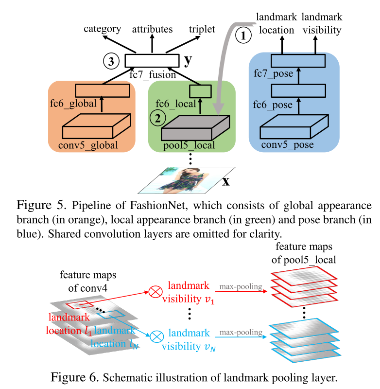

[notes](https://www.notion.so/bluecandle/DeepFashion-ab2ead9c02ec440da0b51c8dbbc84ec5)

# DeepFashion

### 논문

---

https://www.cv-foundation.org/openaccess/content_cvpr_2016/papers/Liu_DeepFashion_Powering_Robust_CVPR_2016_paper.pdf

### 이 논문의 한 줄

---

A unified dataset with all the above annotations is desired

- semantic attributes : color, category, texture
- clothing locations : masks of clothes
- cross-domain image correspondences

### keywords

---

- Fashion
- Dataset
- Comprehensiveness
- Scale
- Availability
- FashionNet
- discriminative representation
- descriptive attributes
- landmark
- cross-pose/cross-domain image pairs

### 내용정리

---

- In-shop 은 온라인 스토어 안에있는 이미지를 하나 가져다가 온라인 스토어에 있는 다른 유사한 이미지를 찾는거고
- consumer-to-shop 은 고객이 찍은 사진 (스토어에 올라온 사진보다 다양한 각도...빛...등등)을 가져다가 온라인 스토에 있는 다른 유사한 이미지를 찾는거.
- 옷마다 landmark 를 예측하여 예측된 landmark를 통해 옷의 feature를 뽑아낸다.

### 문구

---

- Existing datasets are limited in the number of annotations and are difficult to cope with the various challenges in real-world applications
- we propose a new deep model, namely **FashionNet**, which learns clothing features by jointly predicting clothing attributes and landmarks.
- clothes recognition algorithms are often confronted with three fundamental challenges when adopted in real- world applications
    - large variations in style, texture, and cutting
    - frequently subject to deformation and occlusion
    - often exhibit serious variations when they are taken under different scenarios, such as selfies vs. online shopping photos
- This dataset enjoys several distinct advantages over its precedents.
    - Comprehensiveness
    - Scale : over 800K annotated clothing images, doubling the size of the largest one in the literature.
    - Availability
- To demonstrate the usefulness of DeepFashion, we de-
sign a novel deep learning structure, FashionNet, which handles clothing deformation/occlusion by pooling/gating feature maps upon estimated landmark locations.
- a number of deep models have been introduced to learn more discriminative representation in order to handle cross-scenario variations [10, 12]. Although these methods achieved good performance, they ignored the deformations and occlusions in the clothing images, which hinder the further improvement of the recognition accuracy. FashionNet handles such difficulties by explicitly predicting clothing landmarks and pooling features over the estimated landmarks, resulting in more discriminative clothes representation.
⇒ SIFT,HOG 같은 손수 만든 feature에 의존했었는데, 딥러닝 모델을 통해 discriminative representation 을 학습하는 것을 도입하여 성능 향상. 하지만, 옷의 변형(deformation) 겹침(occlusion)을 무시하였음. FashionNet이 landmark를 명시적으로 예측하고 그에 기반하여 feature를 뽑아내는 방법으로 훨신 더 discriminative representation을 얻을 수 있다고 한다.
- 800, 000 diverse fashion images
- annotated with rich information of clothing items. Each image in this dataset is labeled with 50 categories, 1, 000 descriptive attributes, and clothing landmarks
- contains over 300, 000 cross-pose/cross-domain image pairs

### 알고리즘 설명

---

### 기타

---

