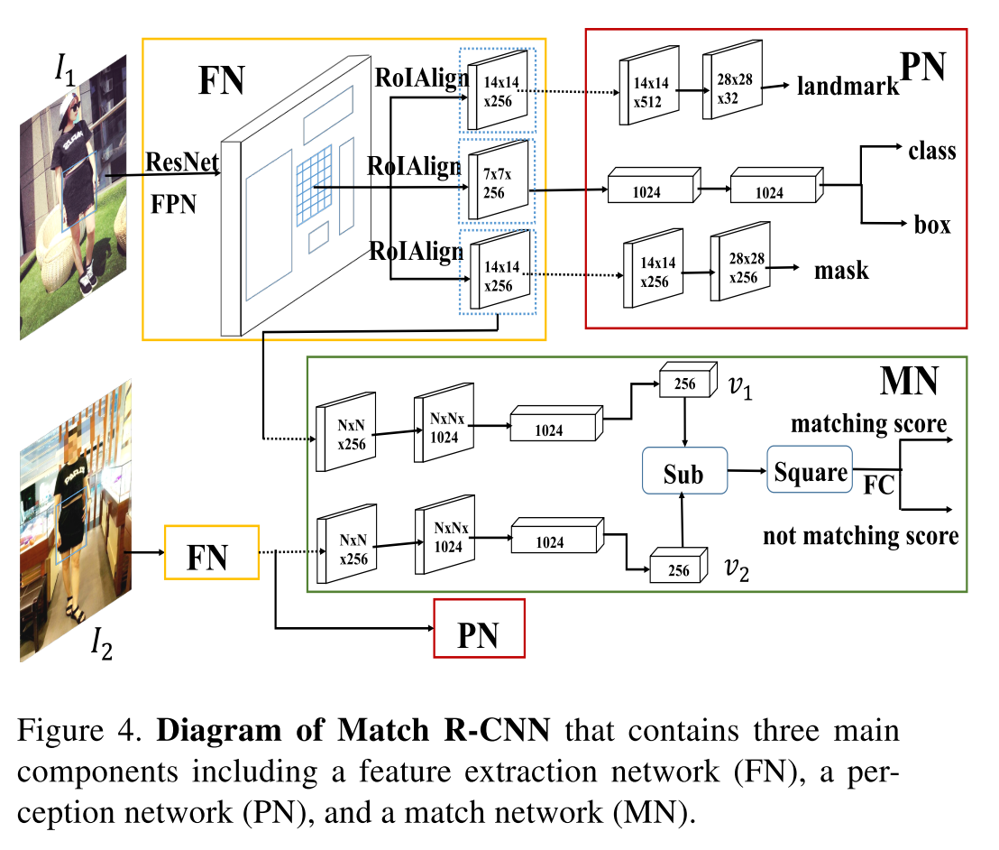

[notes](https://www.notion.so/bluecandle/DeepFashion2-8b966107c81a4394b3bdd5a1b0d36ea3)

# DeepFashion2

### 논문

---

https://arxiv.org/abs/1901.07973

### 이 논문의 한 줄

---

DeepFashion 같은 기존의 의류 데이터셋의 부족한 부분들 ( sparse landmarksm no per-pixel masks 등 ) 을 보완하기 위해 만든 데이터셋.

### keywords

---

- Match R-CNN
- Mask R-CNN
- mask annotation

### 내용정리

---

- DeepFashion 에서 데이터 일부 가져옴.
- 추가로 크롤링 하여 데이터 확보 후, 저해상도, 과하게 occlusion 이 발생한 이미지 등은 사람이 분류하여 제거.
- mask 는 자동으로 외곽선에 따라 생성 후 사람이 보정하는 형식으로 입력되었음.
- Mask R-CNN 기반의 Match R-CNN 이라는 baseline 모델 제공

### 문구

---

- Match R-CNN, which is an end-to-end training framework that jointly learns clothes detection, landmark estimation, instance segmenta- tion, and consumer-to-shop retrieval.

### 알고리즘 설명

---

Match R-CNN

### 기타

---

DeepFashion 이미지와 DeepFashion2 이미지 비교

DeepFashion2 데이터셋과 타 데이터셋 비교