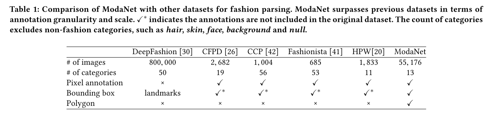

[notes](https://www.notion.so/bluecandle/ModaNet-a3befb2f5d404e3f953f9e32602a7069)

# ModaNet

### 논문

---
https://arxiv.org/abs/1807.01394

[ModaNet: A Large-scale Street Fashion Dataset with Polygon_1807.01394.pdf](images/ModaNet_A_Large-scale_Street_Fashion_Dataset_with_Polygon_1807.01394.pdf)

### 이 논문의 한 줄

---

DeepFashion(2016 처음 등장) 이후 2018년에 기존 fashion dataset의 한계를 극복하기 위해 등장한 또다른 Dataset.

### keywords

---

- Fashion
- Computer Vision
- Dataset
- Street Image
- pixel-level annotations

### 내용정리

---

- DeepFashion(2016 처음 등장) 이후 2018년에 기존 fashion dataset의 한계를 극복하기 위해 등장한 또다른 Dataset. DeepFashion2는 2019년에 등장한다.
- 기존 데이터셋에는 pixel-level annotation이 존재하더라도 몇천개뿐이었는데, ModaNet은 전체 이미지(약 55000장) 에 대한 pixel-level annotation을 전부 했다고 함.

### 문구

---

- a large-scale collection of images based on Paperdoll dataset
- 55, 176 street images, fully annotated with polygons on top of the 1 million weakly annotated street images in Paperdoll
- ModaNet consisting of 55, 176 high-quality, fully-annotated street fashion images on top of the 1 million weakly labeled images in the Paper- doll dataset.
- We annotate 13 categories that are of the most interest in research and real-world commerce applications.
- the annotated images are carefully selected to ensure diversity in human poses, i.e., not limited to the frontal view. In this way, training on this data grants a more generalizable model
- coordinates of polygons enclosing individual fashion items.

### 알고리즘 설명

---

X

### 기타

---

⇒ 확실히 DeepFashion 보다는 이미지 수가 적지만, Pixel annotation, Bounding Box, Polygon 정보가 주어진다.

⇒ 근데, 이후 등장한 DeepFashion2 가 ModaNet보다 더 좋은 것 아닌가?? 거긴 이미지도 많으니까.

⇒ 물론, street image 라는 점에서 이점이 있을 수 있다. ( DeepFashion2 도 occlusion, deformation 등을 해결하기 위해 노력을 많이 하긴 했음 )